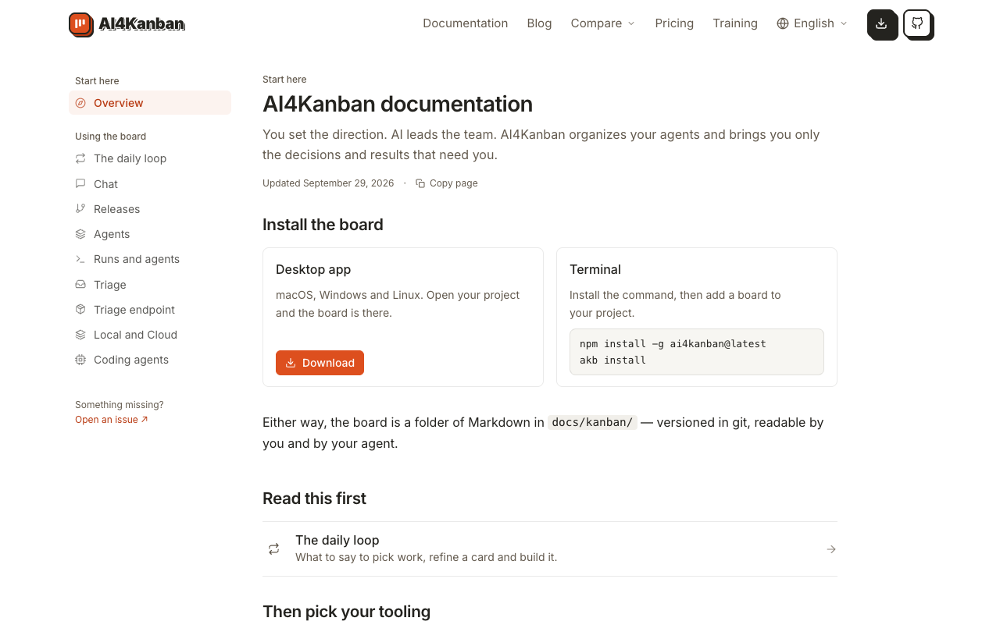
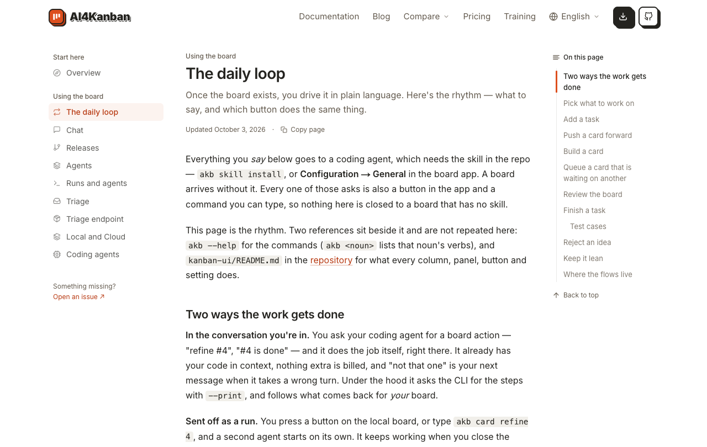
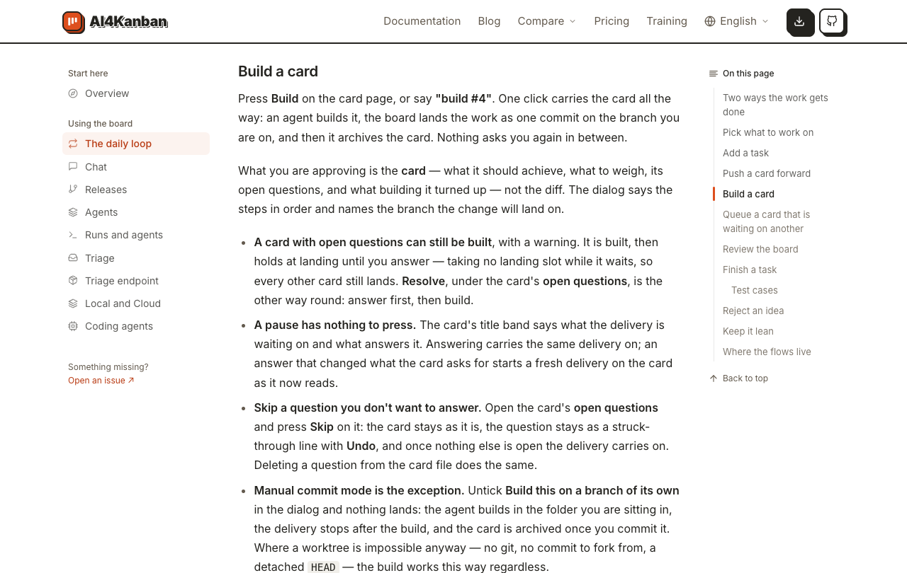
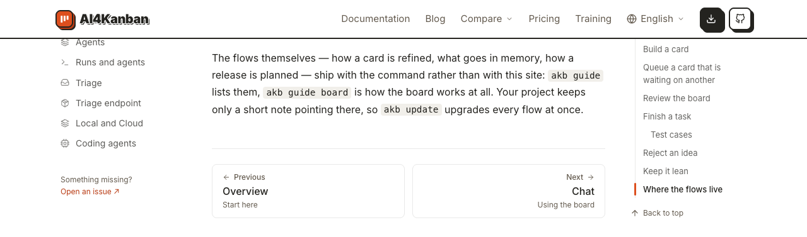
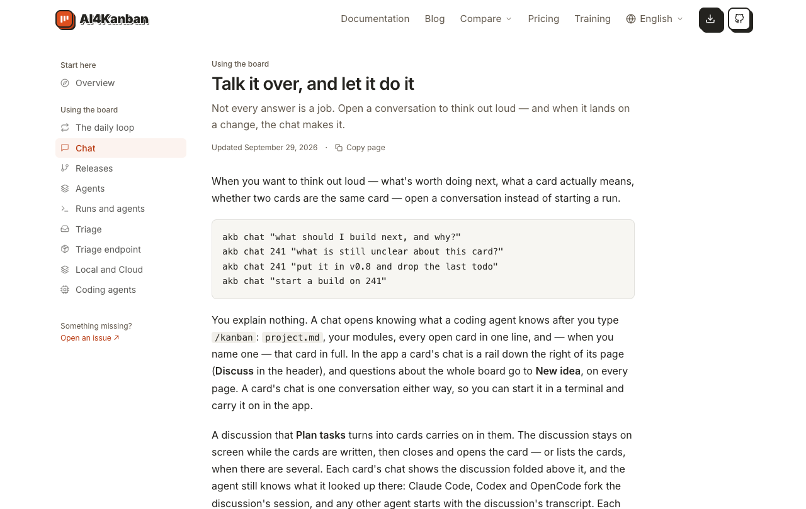

# 从文档首页找到并读完「The daily loop」

## Setup

- **站点**：官网（`web/`）在本地跑起来，浏览器打开 `/docs`，窗口 1280×1000。
- **读者**：刚装好看板、想知道每天怎么用它的新用户。

## Steps

1. 打开 `/docs`。
   左栏「Start here」下「Overview」高亮；正文先是「Install the board」（桌面应用下载和两行安装命令），往下是「Read this first」，里面只有一张「The daily loop」卡片。
   

2. 点「Read this first」里的「The daily loop」。
   进入 `/docs/daily-loop`，标题「The daily loop」；左栏高亮移到「The daily loop」，右侧「On this page」列出 11 个小节加一个子节，第一项高亮。
   

3. 点右侧目录里的「Build a card」。
   页面滚到「Build a card」一节，标题停在页头下方；地址栏带 `#build-a-card`，目录里该项高亮。
   

4. 滚到页面底部。
   最后一节是「Where the flows live」；下面是两张翻页卡：左「Previous / Overview」，右「Next / Chat」。
   

5. 点「Next / Chat」。
   进入 `/docs/chat`，从页顶开始显示，左栏高亮移到「Chat」。
   

## Feedback

- **入口很清楚**：首页「Read this first」只放一张卡，新用户不会选错；左栏、正文卡片、页底翻页三条路都通向同一页。
- **页很长**：「The daily loop」滚到底约 6500px，靠右侧目录才找得到位置；目录高亮跟随滚动，回得去。
- **开头两段先讲前提**：读者要先读过「需要装 skill」「另有两份参考」两段才进到第一节，想直接知道「每天做什么」的人会觉得绕。
- **翻页落点不一致**：从「The daily loop」往后是「Chat」，标题却叫「Talk it over, and let it do it」，和左栏、翻页卡上的名字对不上，第一眼会以为点错了。
- **短页没有目录**：「Chat」只有一个小节，右侧不显示「On this page」，版面和上一页不一样，但不影响阅读。
- **没有跑到的**：窄屏下的这条路径（见 [在文档页之间跳转](../move-between-docs-pages/case.md) 第 5–7 步）、站内搜索、「Copy page」按钮。
