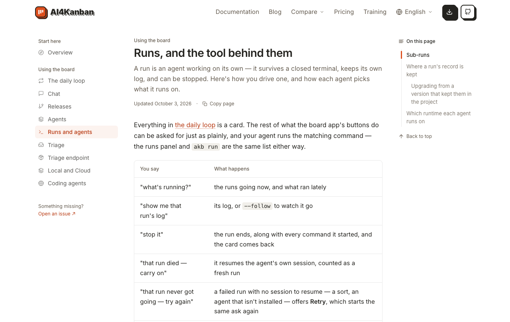
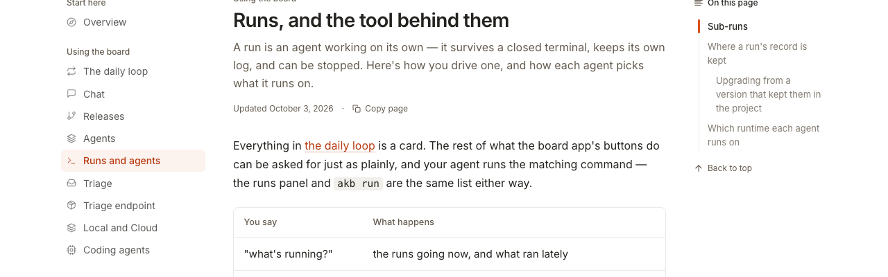
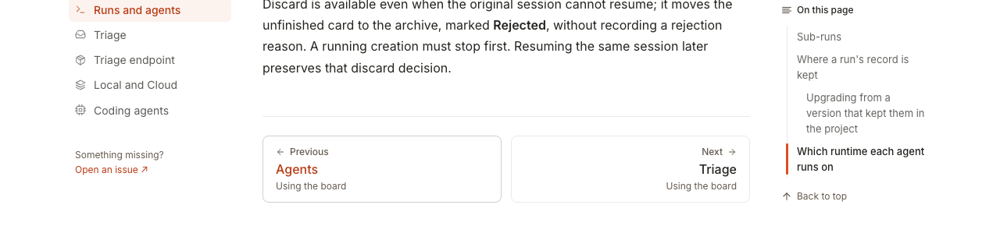
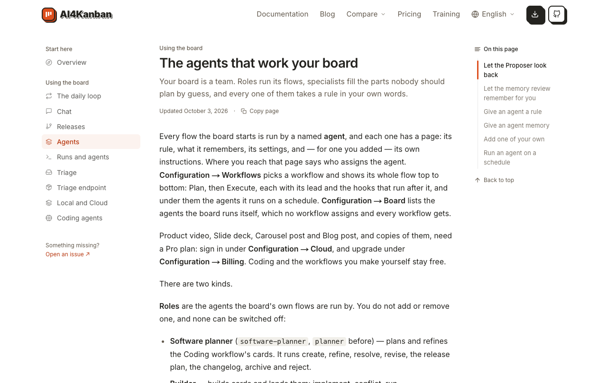
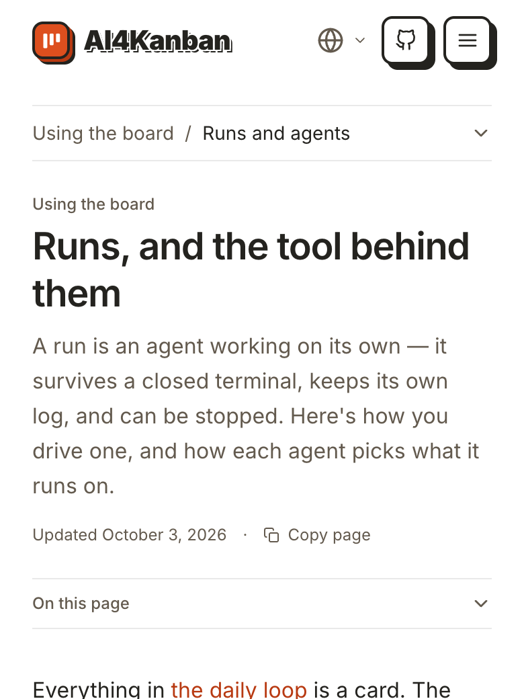
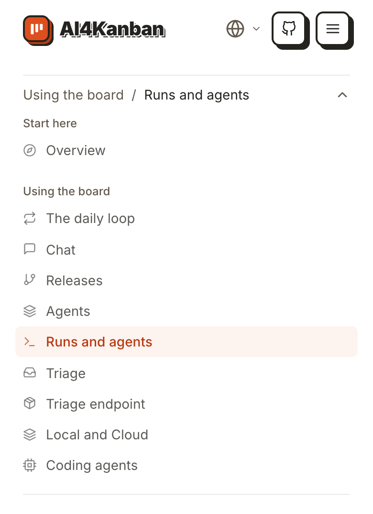
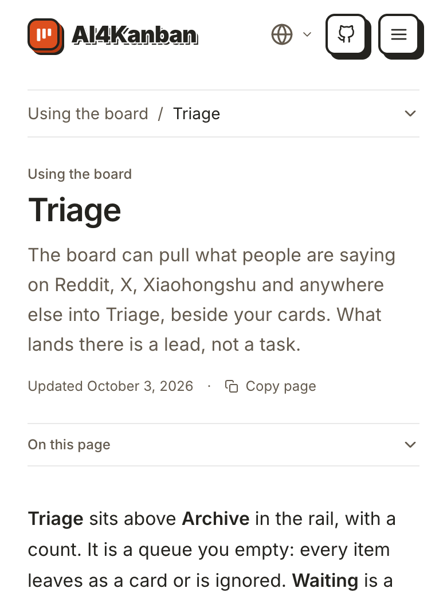

# 在文档页之间跳转

## Setup

- **站点**：官网（`web/`）在本地跑起来，浏览器打开 `/docs/daily-loop`；第 1–4 步窗口 1280×1000，第 5–7 步模拟手机 390×844（触屏）。

## Steps

1. 点左栏的「Runs and agents」。
   进入 `/docs/runs`，标题「Runs, and the tool behind them」，从页顶开始；左栏高亮移到「Runs and agents」。
   

2. 点正文第一段里的链接「the daily loop」。
   链接在新标签页打开 `/docs/daily-loop`，当前标签页仍停在 `/docs/runs`。
   
   [标签页前后对比](02-new-tab.log)

3. 关掉新标签页，在 `/docs/runs` 滚到底。
   两张翻页卡：左「Previous / Agents」，右「Next / Triage」，下面各写所属分组「Using the board」。
   

4. 点「Previous / Agents」。
   进入 `/docs/agents`，从页顶开始，左栏高亮移到「Agents」。
   

5. 换到手机宽度，打开 `/docs/runs`。
   左栏不见了，页头下方是一条折叠栏「Using the board / Runs and agents」，右端一个向下箭头；正文前还有一条折叠的「On this page」。
   

6. 点折叠栏。
   展开完整的文档目录，「Runs and agents」高亮，箭头朝上。
   

7. 点「Triage」。
   进入 `/docs/triage`，目录自动收起，折叠栏变成「Using the board / Triage」。
   

## Feedback

- **左栏、翻页、手机目录都顺手**：高亮总在当前页，跳页后从页顶开始，手机上选完目录自己收起，不用再点一下。
- **正文链接开新标签页**：文档内部互相引用（如「the daily loop」）也用 `target="_blank"`，读几页就攒一排标签页；同站跳转一般期望在原页打开，左栏和翻页也都是原页打开，行为不一致。
- **翻页卡的分组名重复**：前后两张都写「Using the board」，除了「Overview」那一页外几乎都一样，占地方却不提供信息。
- **手机上两条折叠栏挨得近**：「Using the board / Runs and agents」和「On this page」样式相同，第一次看分不清哪条是换页、哪条是本页小节。
- **没有跑到的**：手机上的「On this page」折叠栏、站内搜索、左栏底部的「Open an issue」。
