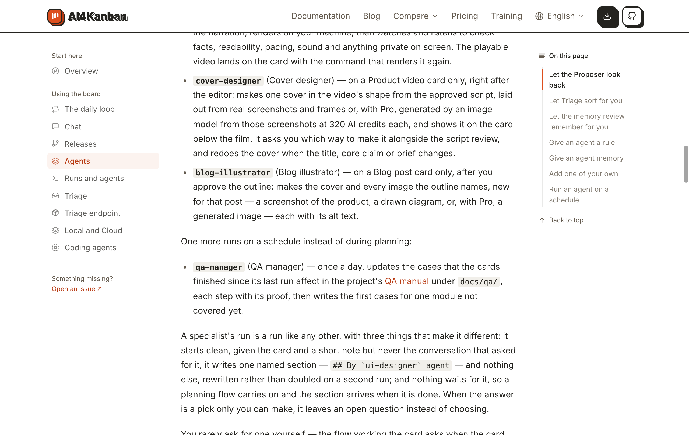
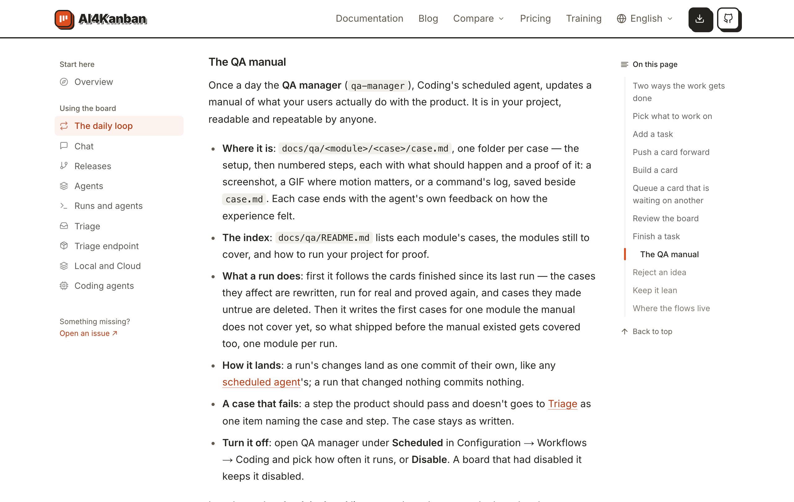
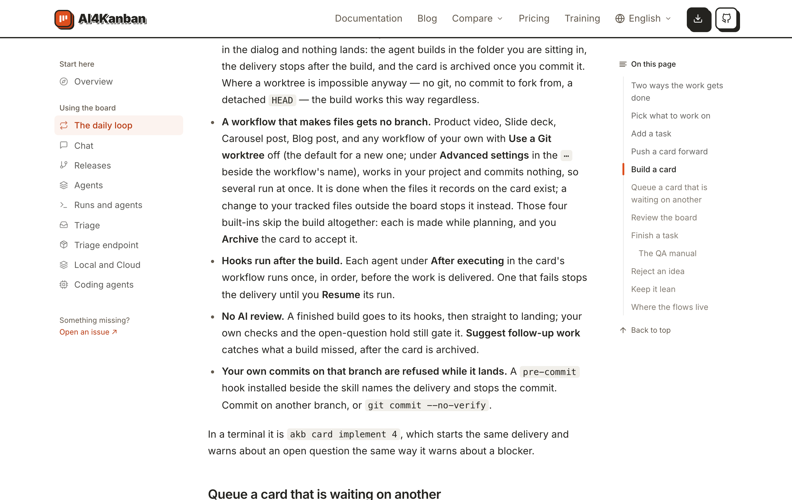

# 在文档里查 QA 手册是怎么维护的

## Setup

- **站点**：官网（`web/`）在本地跑起来，浏览器打开 `/docs/agents`，窗口宽 1280px。
- **读者**：发现项目里多了 `docs/qa/`、或在「配置 → 工作流」里看到「QA manager」，想知道它什么时候跑、改什么、怎么关的人。

## Steps

1. 在「The agents that work your board」页往下滚到自带 Agent 清单的末尾。
   九个规划时的 Agent 之后单独一句「One more runs on a schedule instead of during planning:」，下面一条 **`qa-manager`** (QA manager)：每天一遍，更新上次运行以来完成的卡片影响的场景，再为一个还没补写的模块写出第一批场景；「QA manual」是链接。
   

2. 点「QA manual」。
   在新标签页打开「The daily loop」页并停在「The QA manual」一节，右侧目录里该项高亮。开头一句说 QA manager 是 Coding 的定期运行 Agent、每天一遍。下面六条：**Where it is**（`docs/qa/<module>/<case>/case.md`）、**The index**（`docs/qa/README.md`）、**What a run does**（先跟进完成的卡片，再补写一个模块）、**How it lands**（一遍的改动是它自己的一个提交，没改动就不提交）、**A case that fails**（走不通的一步进 Triage，场景保持原样）、**Turn it off**（Configuration → Workflows → Coding 的 **Scheduled** 下选周期或 **Disable**；之前停用的看板保持停用）。没有「Rerun all of it」这一条。
   

3. 在同一页往上滚到「Build a card」一节里「Hooks run after the build」那一条。
   只说 **After executing** 下的每个 Agent 在构建后各运行一次、失败的会停下交付直到 **Resume**；不再有「Coding ships one, the QA manager」这半句。
   

## Feedback

- **一节讲全了**：在哪、什么时候跑、改什么、怎么落地、失败去哪、怎么关，六条各一句，和界面上的词（Scheduled、Disable）对得上。
- **链接开新标签页**：文档内的链接「QA manual」带 `target="_blank"`，点一下多出一个标签页，原页不动；站内跳转不该这样。
- **花多少没说**：「Once a day」意味着每天一次真实的 agent 运行，补写模块那一遍还会把场景真的走一遍；这一节没有一句提成本，要去「Run an agent on a schedule」才读到「A quiet day still costs one short run」。
- **升级的人找不到自己的那句话**：以前它跟在每次构建后面，现在不跟了——这一节只在最后半句写「A board that had disabled it keeps it disabled」，没有说「它不再挡住交付」「想在落地前把关要自己在 After executing 下建一个」。
- **「modules still to cover」没头没尾**：索引里的「待补写模块」从哪来（看板的 `modules.md`）、补完之后还补不补，这里都没讲。
- **Agents 页的数字对不上**：同一页后面写「the roles and the three the command ships」，而清单里自带的是九个加 `qa-manager`。
- **没有跑到的**：中文等其他语言的文档页、窄屏；`/docs/runs` 里删掉的「A Coding build shows as two runs」一段只用页面文字确认已不在，没有截图。
