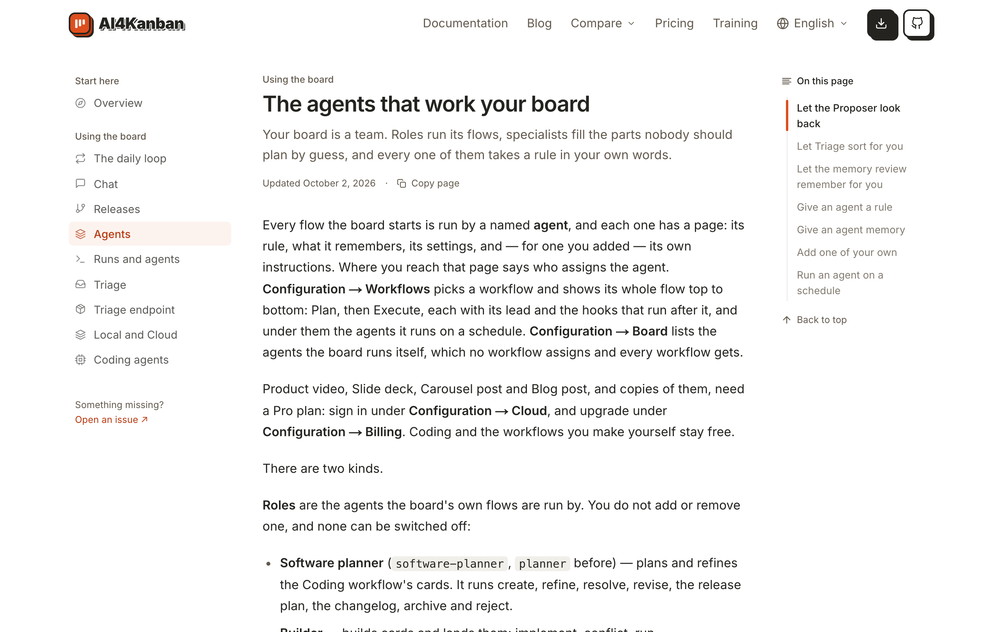
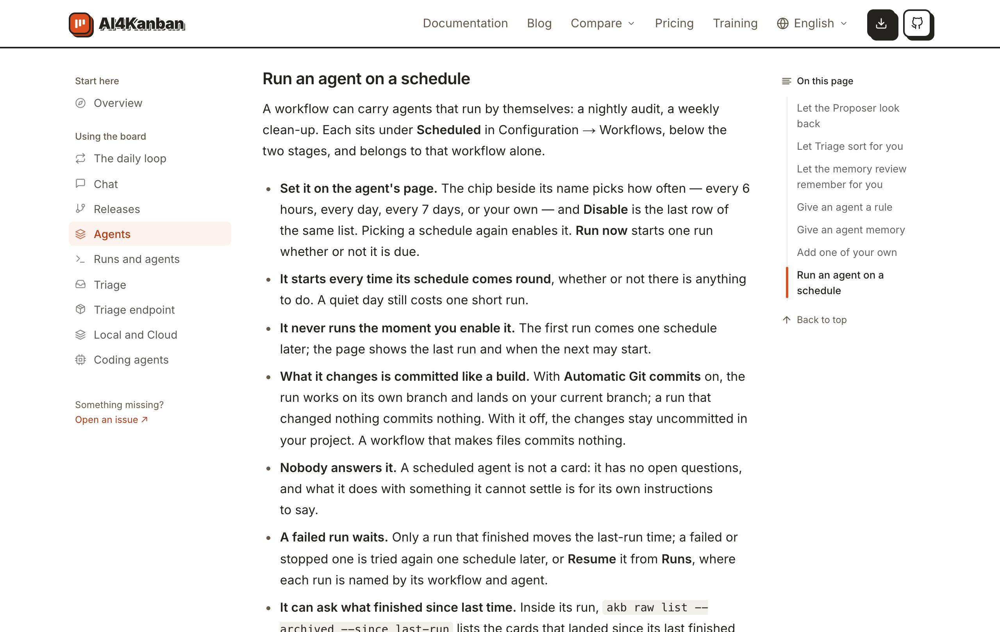
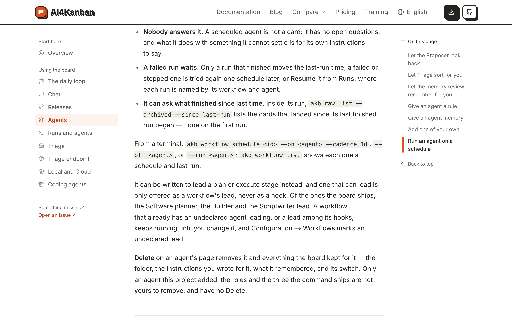

# 在文档里查怎么让一个 Agent 定期运行

## Setup

- **站点**：官网（`web/`）在本地跑起来，浏览器打开 `/docs/agents`，窗口宽 1280px。
- **读者**：想让某件重复的事（每晚检查、每周清理）自己跑起来、还没在看板里找到入口的人。

## Steps

1. 打开文档的「The agents that work your board」页。
   开头一段讲 Configuration → Workflows 时多了半句：两个阶段下面是这个工作流按周期运行的 Agent（「and under them the agents it runs on a schedule」）。右侧「On this page」目录的最后一项是「Run an agent on a schedule」。
   

2. 点目录里的「Run an agent on a schedule」。
   页面滚到这一节，目录里该项高亮。开头说工作流可以带自己运行的 Agent，在 Configuration → Workflows 的 **Scheduled** 下、只属于这个工作流。下面七条粗体开头的要点：在 Agent 页上设（周期小控件、**Disable** 是同一个列表的最后一项、**Run now**）；每个周期都启动，不管有没有事；开启的那一刻不运行；改动像一次构建那样提交（**Automatic Git commits** 开和关各是什么结果）；没人回答它；失败的一遍等一个周期再试，或在 **Runs** 里 **Resume**；运行里可以用 `akb raw list --archived --since last-run` 问上次以来落地了什么。
   

3. 往下滚到这一节的末尾。
   要点之后一句「From a terminal:」给出 `akb workflow schedule <id> --on <agent> --cadence 1d`、`--off <agent>`、`--run <agent>` 和 `akb workflow list`。再往下还有两段——能当 **lead** 的 Agent、Agent 页上的 **Delete**——然后这一页结束。
   

## Feedback

- **照着能做完**：从哪里进、点什么、什么时候第一次跑、改动去哪，一节里都有；和界面上的词（Scheduled、Disable、Run now）对得上，命令也是真的那几条。
- **代价说在明处**：「A quiet day still costs one short run」「It never runs the moment you enable it」两句正是用的人会意外的地方，放在前三条里很好。
- **最后两段放错了节**：讲 **lead** 和 **Delete** 的两段原本接在「Add one of your own」后面，现在被新的一节隔开，落在了「Run an agent on a schedule」下面；读到「It can be written to lead a plan or execute stage instead」的人会以为在说周期 Agent。
- **手动提交的后果只说了一半**：「With it off, the changes stay uncommitted in your project」没说下一句——这些文件不提交，这个 Agent 之后每一遍都起不来。
- **被新的一遍取代没写**：只说失败的一遍可以 **Resume**，没说下个周期一到它连同未提交的改动就被放弃；想晚点再继续的人会丢东西。
- **怎么新建一个没在这一节说**：要回到上一节才知道点 **Scheduled** 下的「+」、或在 `AGENT.md` 里写 `akb.hook: schedule`；这一节直接从「Set it on the agent's page」讲起，假设 Agent 已经在了。
- **「schedule」和「cadence」混用**：正文和界面都说 schedule，命令的开关却是 `--cadence`，文档没有解释两个是一回事，也没列出 `6h`、`1d at 09:30` 这些写法。
- **没有跑到的**：窄屏下的这一节、从站内搜索进到这一节；`cli/src/guide/write-agent.md`（`akb guide write-agent`）和界面里「每个键怎么写」的指南也加了 `schedule` 的说明，这次没有为它们截证据。
