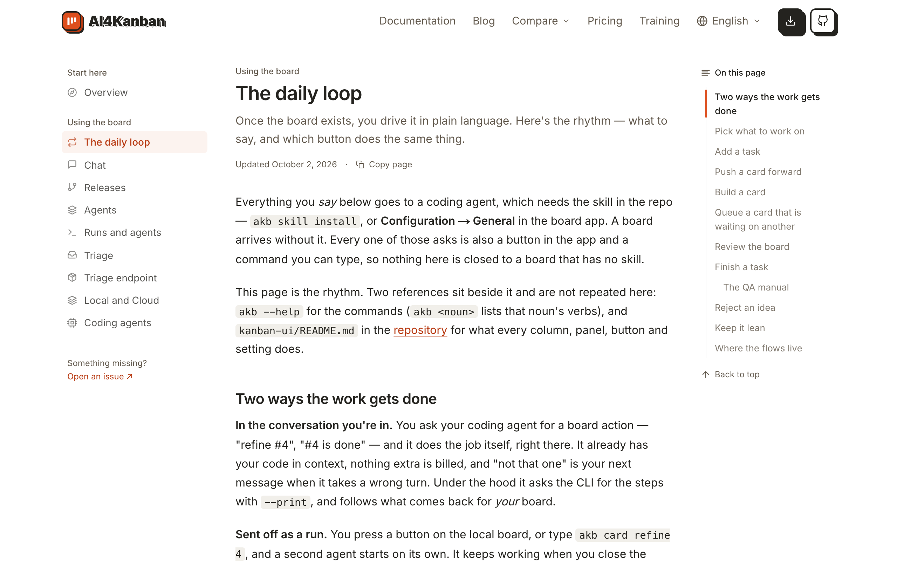
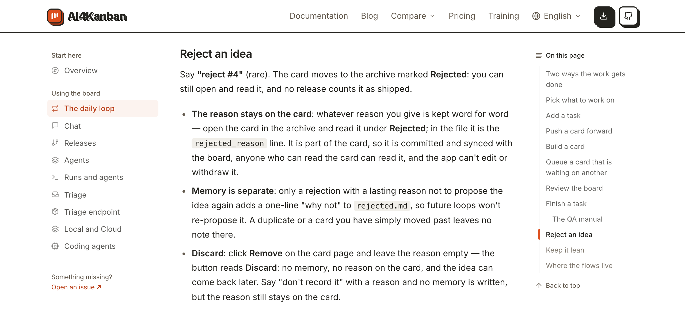

# 在文档里查否决一张卡时写的原因去了哪里

## Setup

- **站点**：官网（`web/`）在本地跑起来，浏览器打开 `/docs/daily-loop`，窗口宽 1280px。
- **读者**：刚在看板上否决过一张卡、想知道填的原因会留在哪的人。

## Steps

1. 打开文档的「The daily loop」页。
   右侧「On this page」目录里有一项「Reject an idea」。
   

2. 点目录里的「Reject an idea」。
   页面滚到这一节，目录里该项高亮。两段：说「reject #4」后卡片进归档、标为 **Rejected**，原因原样留在卡上；值得长期记住的原因还写进 `rejected.md`，这个想法不会再被提出。第二段：不想留原因和记忆，就在卡片页点 **Remove**、原因留空，按钮会变成 **Discard**。
   

## Feedback

- **两段读完**：原因留在卡上、长期的进 `rejected.md`、不想留就 Discard，一眼看完。
- **「谁能看到」没了**：旧版说原因随看板提交和同步、能读卡的人都能读到；现在只说「kept on it word for word」，写了不想公开的话的人不会被提醒。
- **去哪读原因也没了**：旧版说在归档里打开卡、**Rejected** 下面读；现在要自己去找。
- **能不能撤回没说**：写错原因的人读完不知道能不能改。
- **小节叫 Reject，按钮叫 Remove**：第二段直接说点 **Remove**，但第一段的「reject #4」是对 Agent 说的话，界面上否决同样是点 **Remove** 再写原因，这一点要自己推出来。
- **没有跑到的**：窄屏下的这一节、站内搜索。
