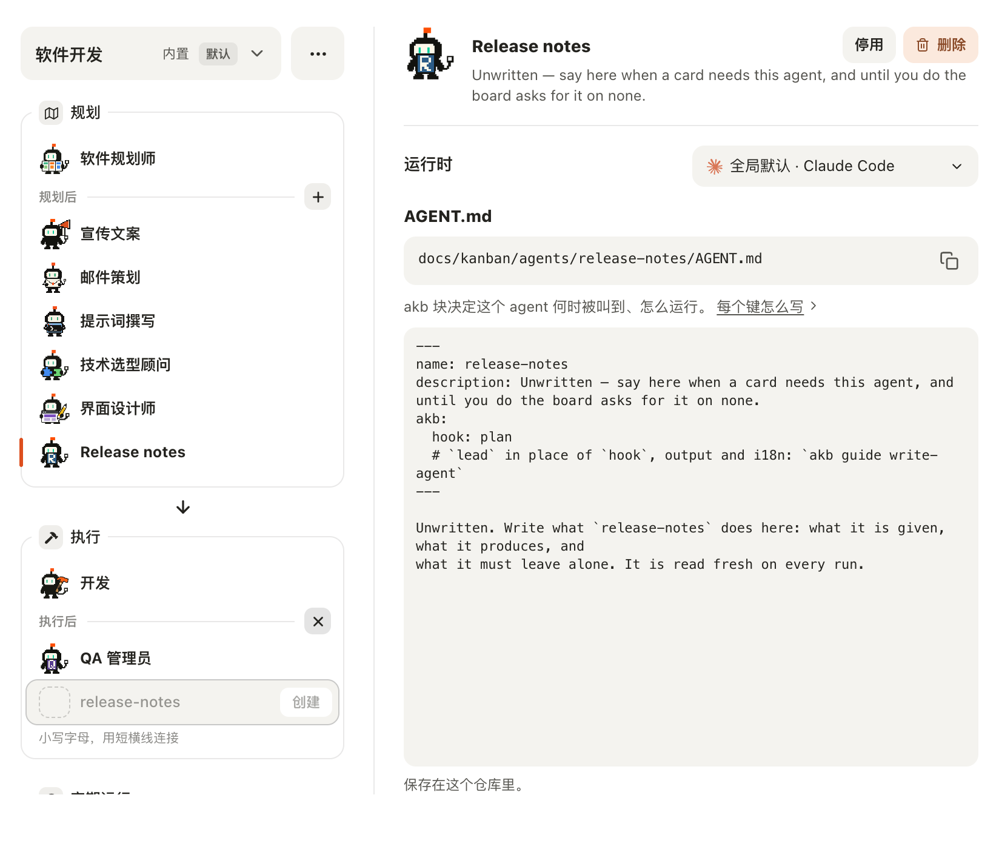
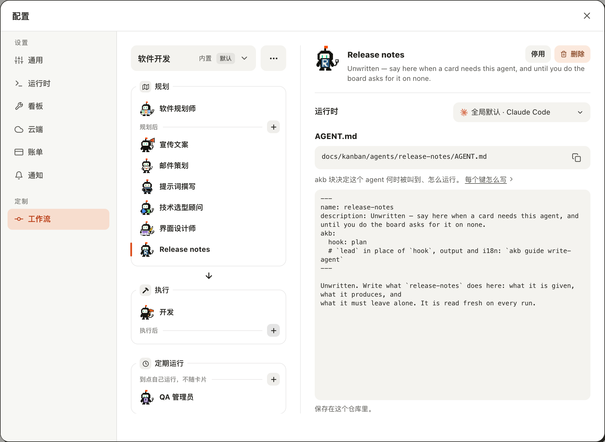

# 在工作流的 Agent 列表里新建一个 Agent

## Setup

- **看板**：一个刚用 `akb install` 建好的看板，界面语言为中文；工作流是内置的「软件开发」，还没有自建 Agent。
- **界面**：在浏览器里打开看板 UI（`kanban-ui`），窗口宽 1280px。

## Steps

1. 点右上角的「配置」，再点左栏的「工作流」。
   中间一栏是「规划」「执行」两个分组框，下面隔开一段还有一个「定期运行」框；当前选中的「软件规划师」没有底色，只在分组框左边线上亮起一小段橙色。「规划后」「执行后」和「定期运行」框里那行小字的右端各有一个灰底的「+」小按钮。
   

2. 点「界面设计师」，再把鼠标移到「提示词撰写」上。
   橙色短线移到「界面设计师」这一行，右侧换成它的详情；鼠标下的「提示词撰写」只铺一层浅灰底，选中的行仍然没有底色。
   

3. 点「规划后」右端的「+」。
   「规划后」这一组的末尾多出一行：虚线空头像位、已聚焦的名称输入（占位符 `release-notes`）、右端变淡且不可点的「创建」；行下一行小字「小写字母，用短横线连接」。刚点的「+」变成「×」，「执行后」和「定期运行」的「+」不变。
   

4. 输入 `qa-manager`，按回车。
   没有创建：行下的小字换成棕红色的拒绝原因「`qa-manager` is an agent the command ships. Pick another name.」，输入的名称还在，光标仍在输入里。
   

5. 全选输入里的名称，改成 `release-notes`。
   一改字，拒绝原因就换回灰色的名称提示；「创建」是白底深色字，可以点。
   

6. 按回车。
   新建行消失，「规划后」这一组末尾多出「Release notes」并被选中（橙色短线在它左边）；右侧是它的 `AGENT.md` 路径和内容，「×」变回「+」。
   

7. 点「执行后」右端的「+」。
   新建行出现在「执行后」这一组的末尾，这一组的「+」变成「×」；「规划后」和「定期运行」的「+」不变。下面的「定期运行」框被挤出可视区，只露出标题的上沿。
   

8. 在名称输入里按 Esc。
   只有新建行收起，「配置」窗口还开着，「×」变回「+」。
   

9. 再点「执行后」的「+」，然后点它变成的「×」。
   新建行收起，按钮变回「+」，窗口还开着。
   [09-cancel-with-cross.log](09-cancel-with-cross.log)

## Feedback

- **列表安静多了**：整列只剩一小段橙色，一眼能找到当前选中的行；但它只有 3px 宽、压在边线上，扫一眼时比原来整行底色容易漏掉，尤其选中行在列表靠下的位置时。
- **「+」现在看得出能点**：灰底小方块读得出是按钮；输入时变「×」也顺手。只是「+」在分组标题那一行，新建行却出现在这一组的最末尾，组里 Agent 多的时候两者隔着五六行，眼睛要往下找。
- **拒绝原因是英文**：中文界面里冒出一句「is an agent the command ships」，而且「the command」对用户没有意义；名称保留、光标不丢这一点很好，改一个字提示就恢复。
- **「创建」不起眼**：白底小字在灰色行里不像主操作，第一次用更可能直接按回车；名称为空时它只是变淡，没有别的说明。
- **创建之后是半成品**：新 Agent 的显示名是自动生成的「Release notes」，简介和正文是英文的「Unwritten — …」占位，中文看板上显得突兀；选中后右侧的 `AGENT.md` 编辑框立刻带着一圈粗橙色聚焦框，和这次「橙色只留给选中标记」的方向不太一致。
- **三个「+」长得一样**：现在一列里有三个同样的灰底「+」，各自新建的是规划后、执行后、定期运行三种不同的 Agent；区别只在左边那行小字，建错了地方要删掉重来。
- **列表变长了**：多了「定期运行」框之后，1280×900 的窗口里这一列刚好放满；「规划后」再多一个 Agent 或打开「执行后」的新建行，最下面的框就被挤到要滚动才看得到。
- **Esc 的两层**：在输入里按 Esc 只收起新建行是对的；要关窗口得再按一次，这一点界面上没有提示，不过符合直觉。
- **没有跑到的**：「创建中…」的过渡在本机一闪而过，没有截到；英文界面、键盘 Tab 聚焦「+」的轮廓、很长的拒绝原因换行，这次都没有验证；「定期运行」框里的「+」在 `set-a-workflow-agent-to-run-on-a-schedule` 那个用例里跑。
