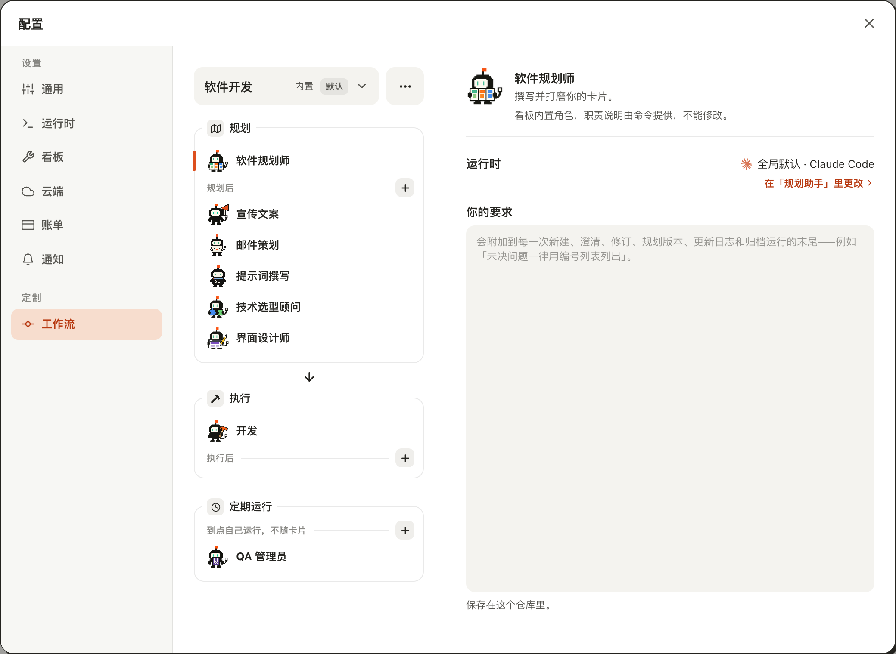
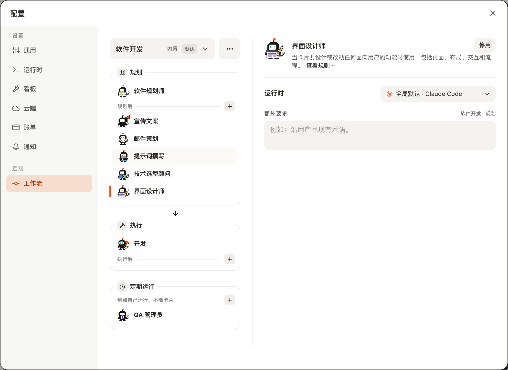
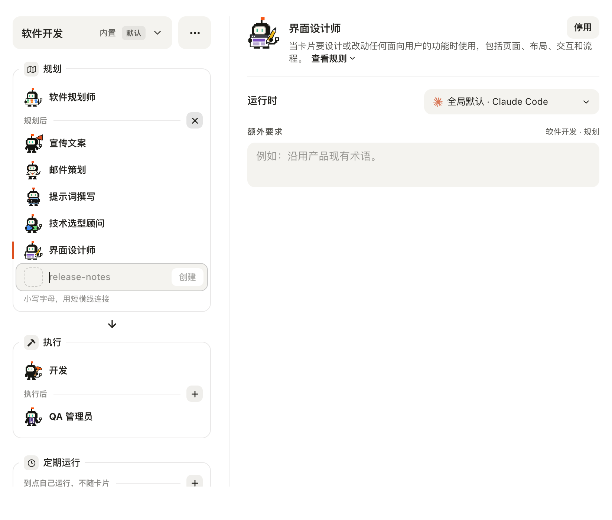
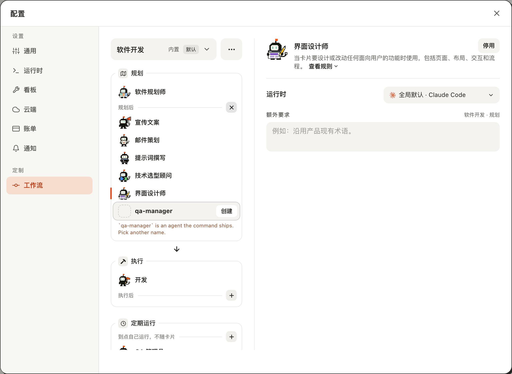
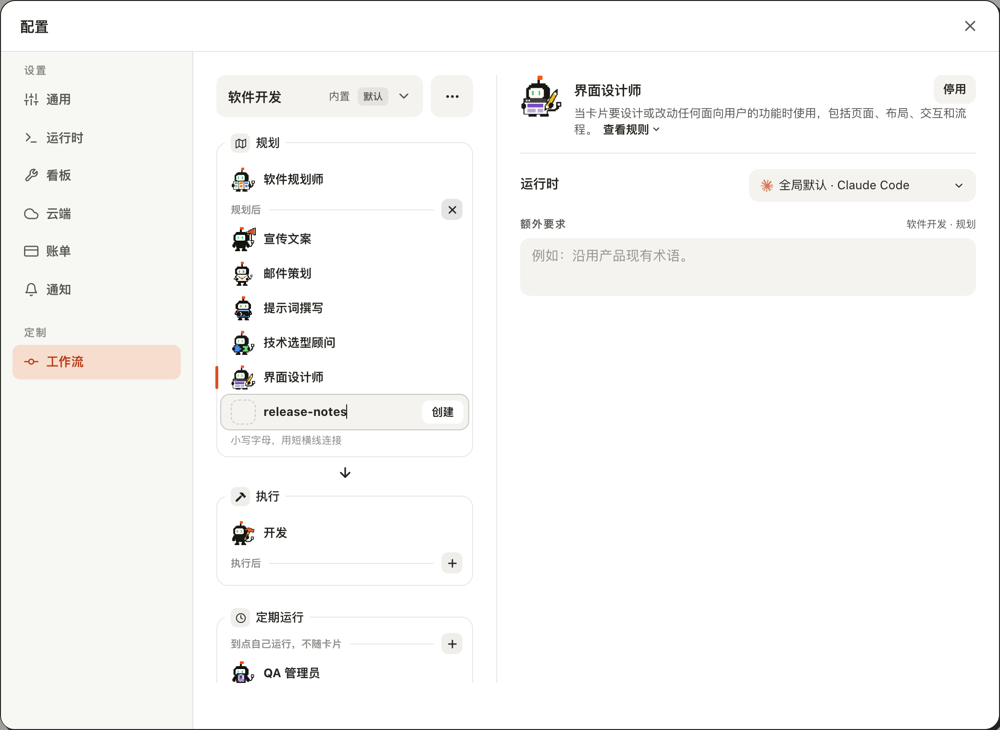
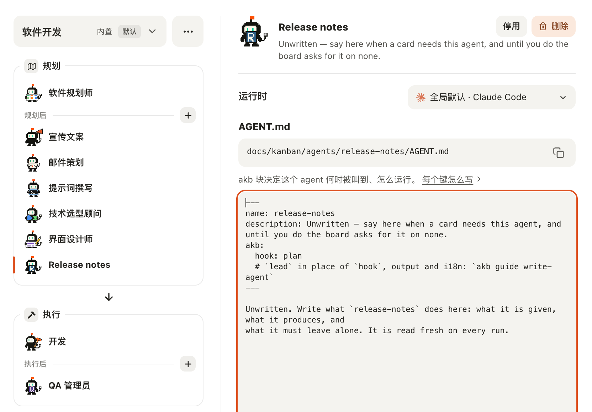

# 在工作流的 Agent 列表里新建一个 Agent

## Setup

- **看板**：一个刚用 `akb install` 建好的看板，界面语言为中文；工作流是内置的「软件开发」，还没有自建 Agent。
- **界面**：在浏览器里打开看板 UI（`kanban-ui`），窗口宽 1280px。

## Steps

1. 点右上角的「配置」，再点左栏的「工作流」。
   中间一栏是「规划」「执行」两个分组框，下面隔开一段是「定期运行」框，里面是自带的「质检员」。「规划」框第一行是领头的「软件规划师」，它下面是一行小字「规划助手」，带着竞品调研、文案与文档、邮件策划等七个 Agent；「执行」框里只有「开发」，没有小字也没有「+」。当前选中的「软件规划师」没有底色，只在分组框左边线上亮起一小段橙色；右侧是它的简介「撰写并细化你的卡片。」、运行时和「你的要求」。「规划助手」和「定期运行」那两行小字的右端各有一个灰底的「+」小按钮。
   

2. 点「界面设计师」，再把鼠标移到「提示词撰写」上。
   橙色短线移到「界面设计师」这一行，右侧换成它的详情；鼠标下的「提示词撰写」只铺一层浅灰底，选中的行仍然没有底色。
   

3. 点「规划助手」右端的「+」（悬停名称「新建规划助手」）。
   「规划助手」这一组的末尾多出一行：虚线空头像位、已聚焦的名称输入（占位符 `release-notes`）、右端变淡且不可点的「创建」；行下一行小字「小写字母，用短横线连接」。刚点的「+」变成「×」，「定期运行」的「+」不变。
   

4. 输入 `qa-manager`，按回车。
   没有创建：行下的小字换成棕红色的拒绝原因「`qa-manager` is an agent the command ships. Pick another name.」，输入的名称还在，光标仍在输入里。
   

5. 全选输入里的名称，改成 `release-notes`。
   一改字，拒绝原因就换回灰色的名称提示；「创建」是白底深色字，可以点。
   

6. 按回车。
   新建行消失，「规划助手」这一组末尾多出「Release notes」并被选中（橙色短线在它左边）；右侧是它的 `AGENT.md` 路径和内容（`hook: plan`），「×」变回「+」。
   

7. 再点「规划助手」的「+」，在名称输入里按 Esc。
   只有新建行收起，「配置」窗口还开着，「×」变回「+」。
   

8. 再点「规划助手」的「+」，然后点它变成的「×」。
   新建行收起，按钮变回「+」，窗口还开着。
   [08-cancel-with-cross.log](08-cancel-with-cross.log)

## Feedback

- **软件规划师看起来没变**：改成 `AGENT.md` 领头 Agent 之后，它仍在「规划」框第一行、仍叫「软件规划师」、右侧仍是简介加「你的要求」，用户察觉不到这次改动。
- **「规划助手」撞名**：「配置 → 看板」里早有一个叫「规划助手」的 Agent，软件规划师右侧那句红字「在「规划助手」里更改」说的是它，不是左边这一组；同一个窗口里同一个词指两样东西。
- **列表变长，开始要滚动**：规划助手现在有七个，1280×900 的窗口里一打开，「定期运行」框的底边就被裁掉一截；新建行打开或多一个 Agent 后，「定期运行」里的「+」和质检员都要往下滚才看得到。
- **「执行」框孤零零一行**：只剩「开发」，没有一句话说明这里不能加 Agent。
- **拒绝原因是英文**：中文界面冒出「is an agent the command ships」，「the command」对用户没有意义；好在名称保留、光标不丢，改一个字提示就恢复。
- **「创建」不起眼**：白底小字在灰色行里不像主操作，多数人会直接按回车；名称为空时只是变淡，没有别的说明。
- **创建之后是半成品**：显示名是自动生成的「Release notes」，简介和正文是英文的「Unwritten — …」占位，在中文看板上突兀；选中后 `AGENT.md` 编辑框立刻带一圈粗橙色聚焦框，像是报错。
- **「+」在标题行、新建行在组尾**：组里有七八个 Agent 时两者隔得很远，眼睛要往下找。
- **没有跑到的**：英文界面、键盘 Tab 聚焦「+」的轮廓、很长的拒绝原因换行；「定期运行」框里的「+」在 `set-a-workflow-agent-to-run-on-a-schedule` 那个用例里跑。
