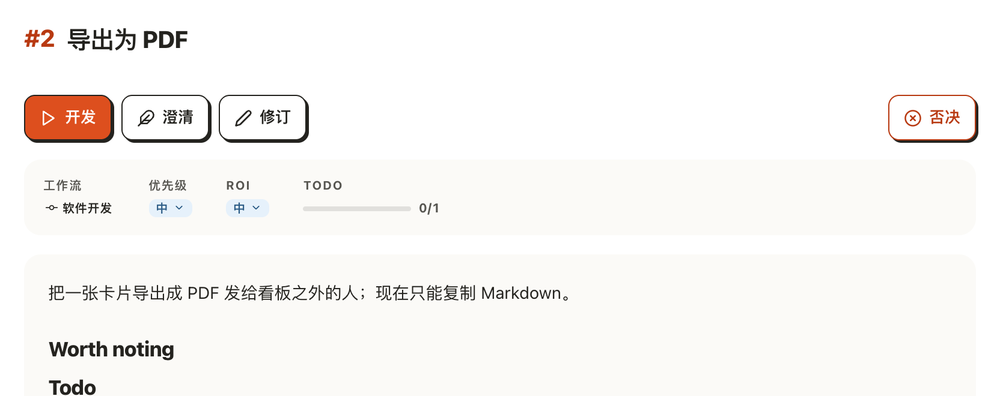
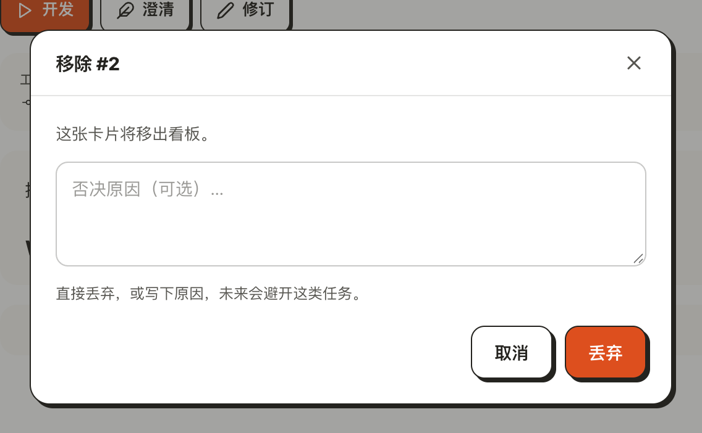
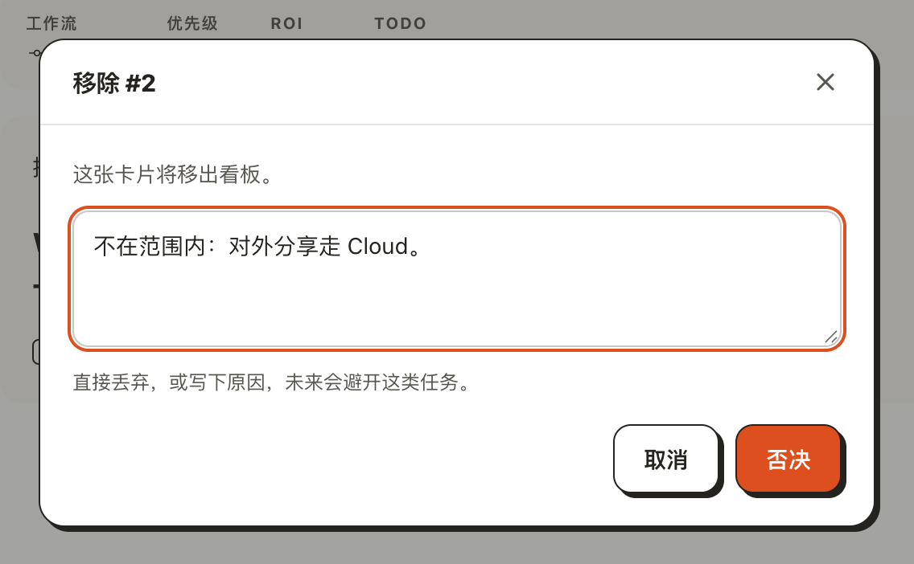
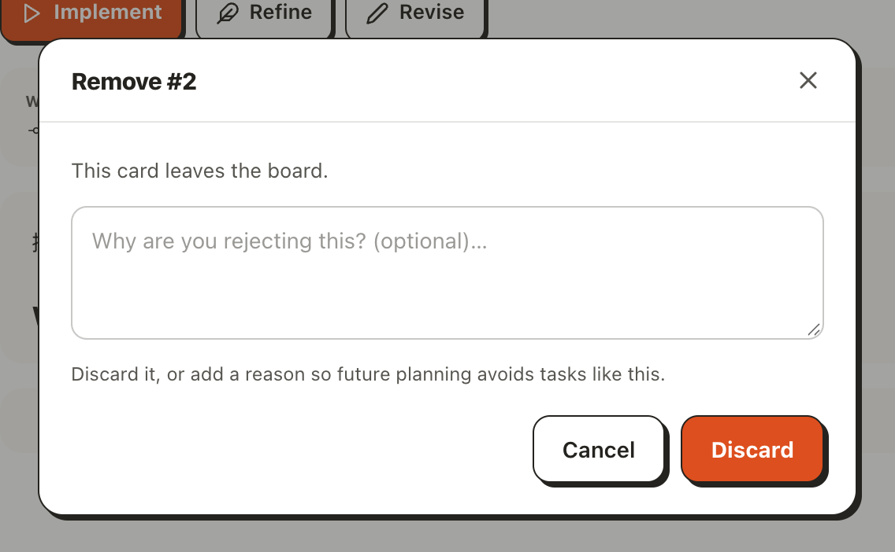

# 移除一张卡时决定写不写原因

## Setup

- **看板**：一个刚用 `akb install` 建好的看板，界面语言为中文，待办里有一张卡 #2「导出为 PDF」（`akb raw create --title "导出为 PDF" --slug export-to-pdf --body-file <正文>`），正文的 `## Todo` 下有一条未勾的待办。
- **界面**：在浏览器里打开看板 UI（`kanban-ui`）的 `/2`，窗口宽 1280px。第 4 步把机器设置里的 `language` 改成 `en` 并重启看板 UI。
- **不确认**：每一步都停在对话框里，不点「丢弃」或「否决」。

## Steps

1. 打开卡片 #2 的页面。
   操作栏右端是描红边的「移除」按钮，与「开发」「澄清」「修订」分开；页面上没有叫「否决」的按钮。
   

2. 点「移除」。
   弹出「移除 #2」对话框，标题与刚点的按钮同名：一句「这张卡片将移出看板。」，一个占位符为「原因（可选）…」的输入框，输入框下一行提示「直接丢弃，或写下原因，未来会避开这类任务。」；输入框空着时确认按钮写「丢弃」。
   

3. 在输入框里输入「不在范围内：对外分享走 Cloud。」。
   确认按钮变成「否决」；提示语原样留在输入框下，不随输入变化。
   

4. 换成英文界面，再打开 `/2` 点「Remove」。
   对话框标题「Remove #2」，输入框的占位符是「Reason (optional)…」，提示是「Discard it, or add a reason so future planning avoids tasks like this.」，空着时按钮写「Discard」。
   

## Feedback

- **入口和标题对上了**：点「移除」，弹出「移除 #2」，不用再想「否决」和「移除」是不是一回事；入口也不再替你先选结果。
- **两个结果只在确认按钮上分开**：空着是「丢弃」、写了才是「否决」，输入框、提示语和按钮三处读下来是同一件事。
- **「否决」藏深了**：卡片页上找不到这个词，要打开对话框并写下原因才出现；照着文档里「reject」来找按钮的人第一眼会找不到。
- **「移除」听起来像删除**：红边加叉号的「移除」看不出卡片其实进了归档、还能再打开；对话框里的「移出看板」也没说去了哪。
- **占位符很泛**：「原因」前面没有动词，要靠标题和下面的提示才知道是什么的原因；扫一眼够用，单看这一行不够。
- **没说谁能看到**：原因会原样留在归档卡片上并随看板同步，对话框里看不出来，写的时候不会想到措辞。
- **丢弃的后果没说**：提示不提丢弃的想法以后可能被重新提出，只写了丢弃的人不知道它会回来。
- **没有跑到的**：没有点确认，否决和丢弃之后的结果不在这个用例里；交付进行中按钮变灰的样子、手机宽度（对话框变成整页）和 `cloud-ui` 里的同一个按钮也没有验证。
