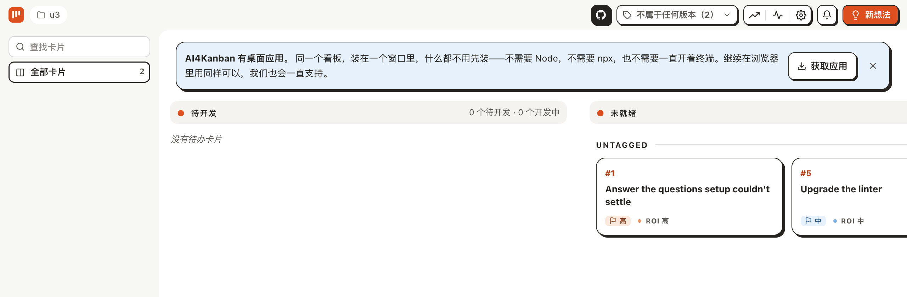
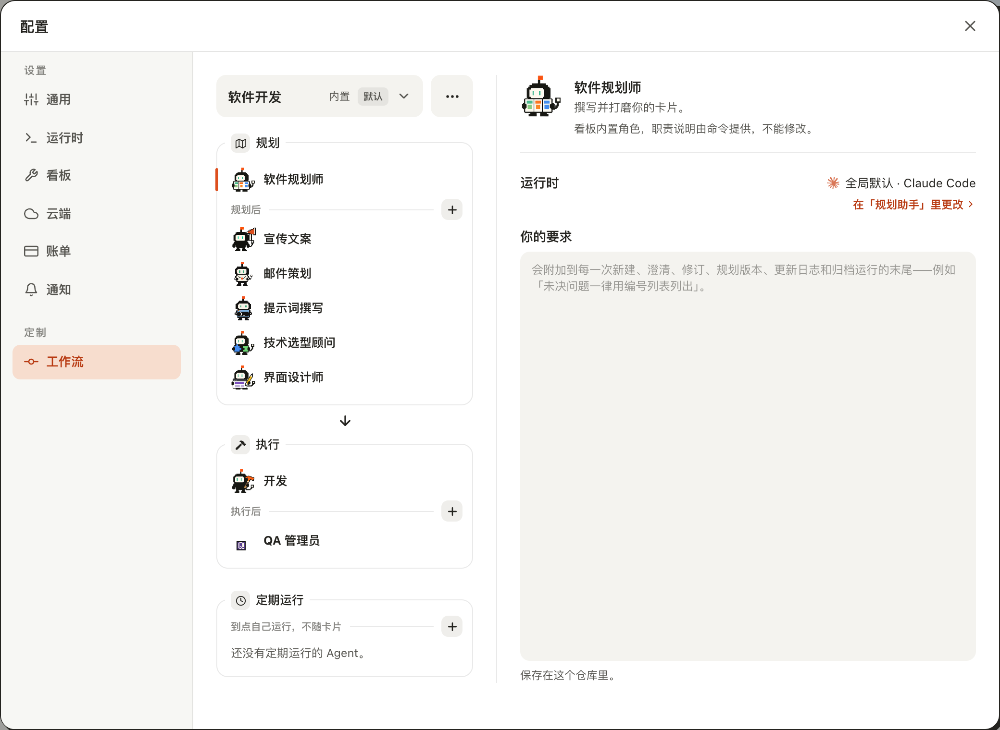
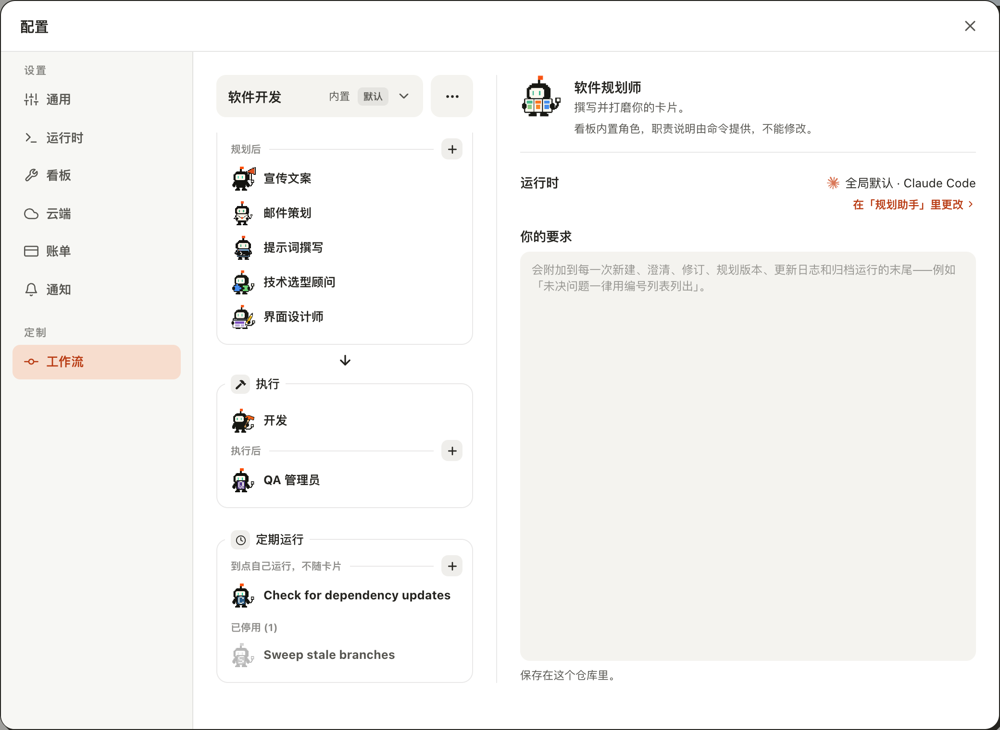
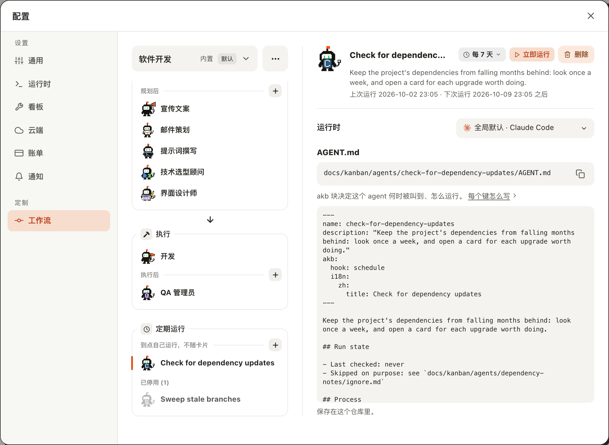
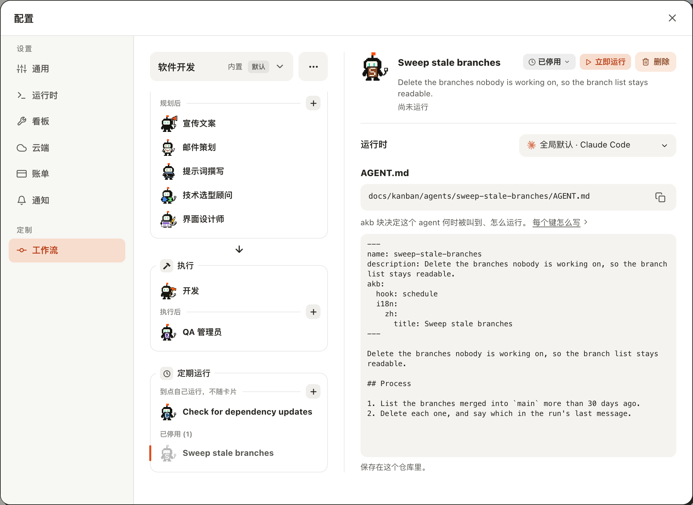
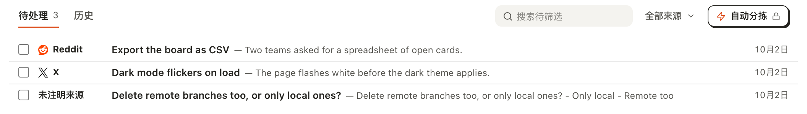

# 升级后在「工作流」里找到原来的周期任务卡

## Setup

- **看板**：上一版留下的看板，带四张周期任务卡和一张 `related` 指向其中一张的普通卡——建法见 [`skill/recurring-cards-become-scheduled-agents-on-update`](../../skill/recurring-cards-become-scheduled-agents-on-update/case.md) 的 Setup（`seed.sh`）。升级后没有执行过 `akb update`。
- **界面**：这次构建的 `kanban-ui`（`AI4KANBAN_CLI` 指向这次构建出的 `cli/dist/kanban.mjs`），界面语言为中文，在浏览器里打开看板，窗口 1280×1000。
- **没有 Agent**：这台机器上没有可用的 Agent，看板自己想起的运行都立刻失败，与本用例无关。

## Steps

1. 打开看板。
   没有「周期任务」一栏；看板上只有 #1 和 #5 两张普通卡，「全部卡片」是 2。四张周期任务卡哪里都不在。
   

2. 马上点右上角的「配置」，再点「工作流」。
   「定期运行」框里写着「还没有定期运行的 Agent。」——此时卡片文件还在 `todo/recurring/` 里，看板的第一次巡检还没走。
   

3. 关掉「配置」，等大约一分钟，再打开「配置 → 工作流」，把左边一列滚到底。
   「定期运行」框里多出「Check for dependency updates」，「已停用 (1)」小标题下是头像变灰的「Sweep stale branches」。没有 `## Process` 的那张「Post the weekly summary」和「Fetch triage items」都不在。
   

4. 点「Check for dependency updates」。
   周期小控件是「每 7 天」，描述是卡片开头那段话，下面一行「上次运行 <卡上的上次运行> · 下次运行 <七天后> 之后」；`AGENT.md` 里是卡上的 `## Run state` 和 `## Process`。名称在名称行里被截成「Check for dependenc…」。
   

5. 点「Sweep stale branches」。
   小控件是「已停用」，下面一行只有「尚未运行」；「立即运行」是可点的样子。`AGENT.md` 里是卡上的 `## Process`。
   

6. 关掉「配置」，点左下角的「待筛选」。
   多出一条「Delete remote branches too, or only local ones?」——原来 #4 上没回答的问题，两个选项接在摘要里；来源一栏写「未注明来源」。
   

## Feedback

- **卡片先消失，Agent 后出现**：一打开看板周期任务卡就不见了，而「定期运行」框要等看板第一次巡检（约一分钟）才有东西。这一分钟里去找的人只会看到「还没有定期运行的 Agent。」，没有任何一句话说它们正在搬过来。
- **界面上没有任何交代**：没有提示、没有通知说「周期任务已移到配置 → 工作流」。习惯在看板上找「周期任务」一栏的人，得自己想到去「配置」里翻；「定期运行」框还在那一列的最底下，1280×1000 的窗口里要滚动才看得全。
- **没迁成的卡无处可寻**：缺 `## Process` 的那张卡既不在看板上，也不在「工作流」里，界面没有任何地方提到它；只有在终端跑 `akb update` 才看得到原因。
- **「Fetch triage items」悄悄没了**：给它设过周期的人，自动拉取就此停止，界面上同样没有一句话。
- **停用的那个点不动**：「Sweep stale branches」的「立即运行」看着可点，点了不运行，拒绝的提示显示在「配置」窗口后面——见 [`set-a-workflow-agent-to-run-on-a-schedule`](../set-a-workflow-agent-to-run-on-a-schedule/case.md) 的第 9、10 步。原来靠点「Run」手动跑的卡，现在没有对应的做法。
- **长名字被截断**：名称行里「Check for dependenc…」只露出一半，完整名字要悬停或看左边的列表；卡片标题通常比 Agent 名长，迁来的大多会这样。
- **待筛选里看不出问题从哪来**：条目文件里记着 `agent sweep-stale-branches`，列表却显示「未注明来源」；摘要把问题又重复了一遍，选项挤成一行「- Only local - Remote too」。在这里答了它，Agent 的规则也不会变。
- **没有跑到的**：英文界面；手机宽度；属于 Coding 以外工作流的卡；桌面应用；点开待筛选条目的详情。
