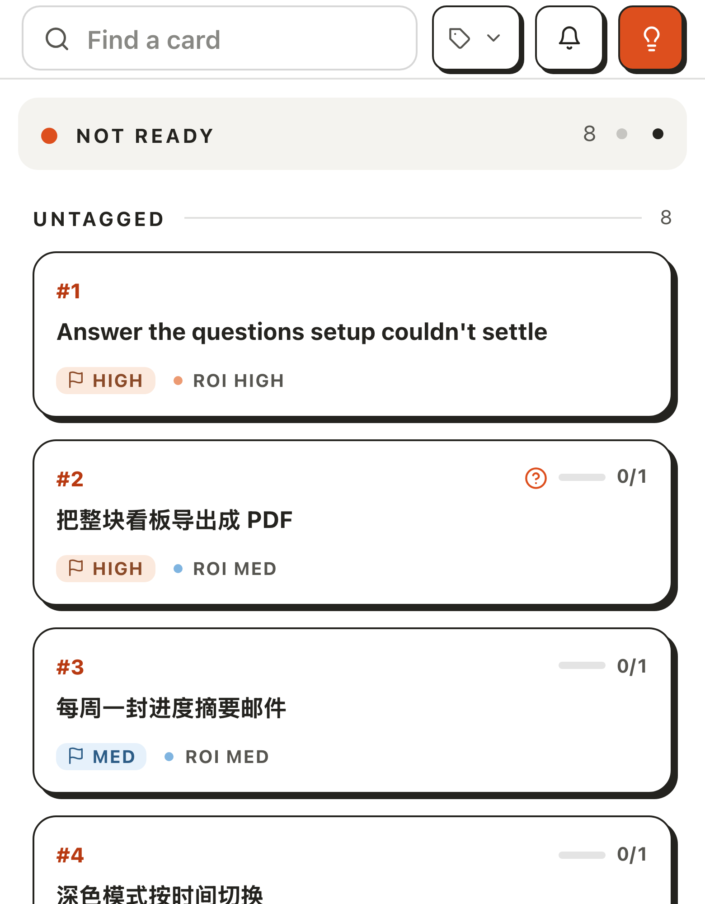
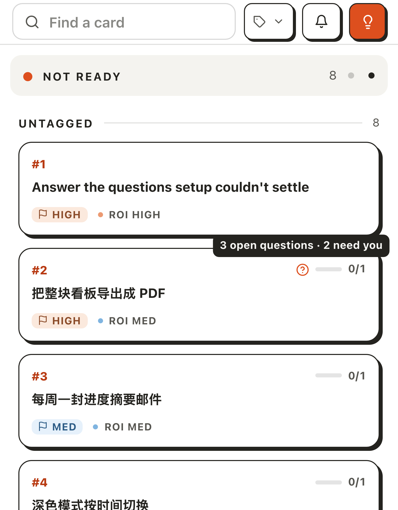
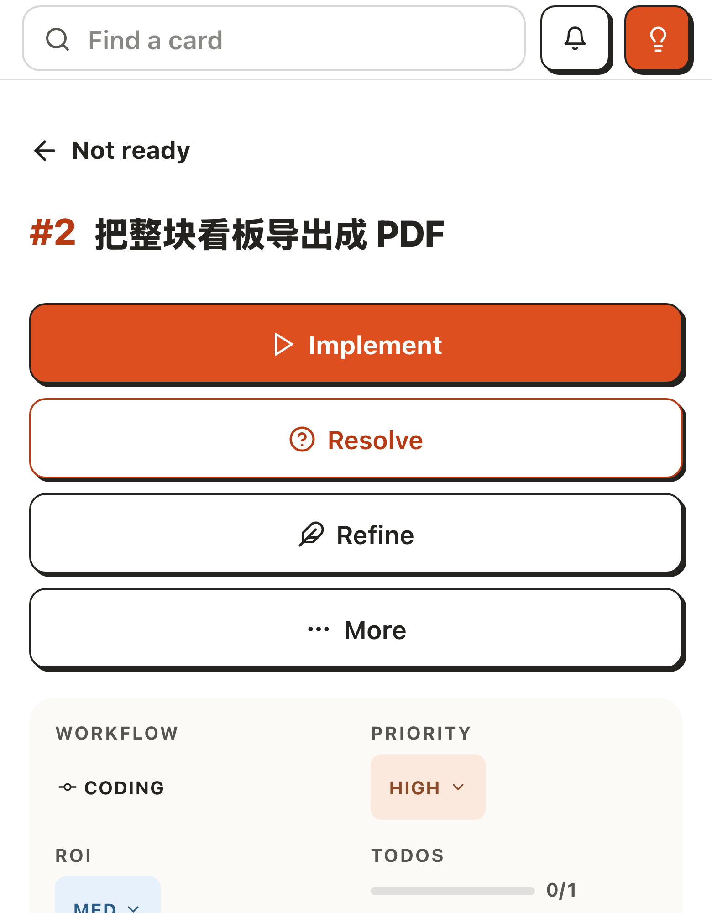
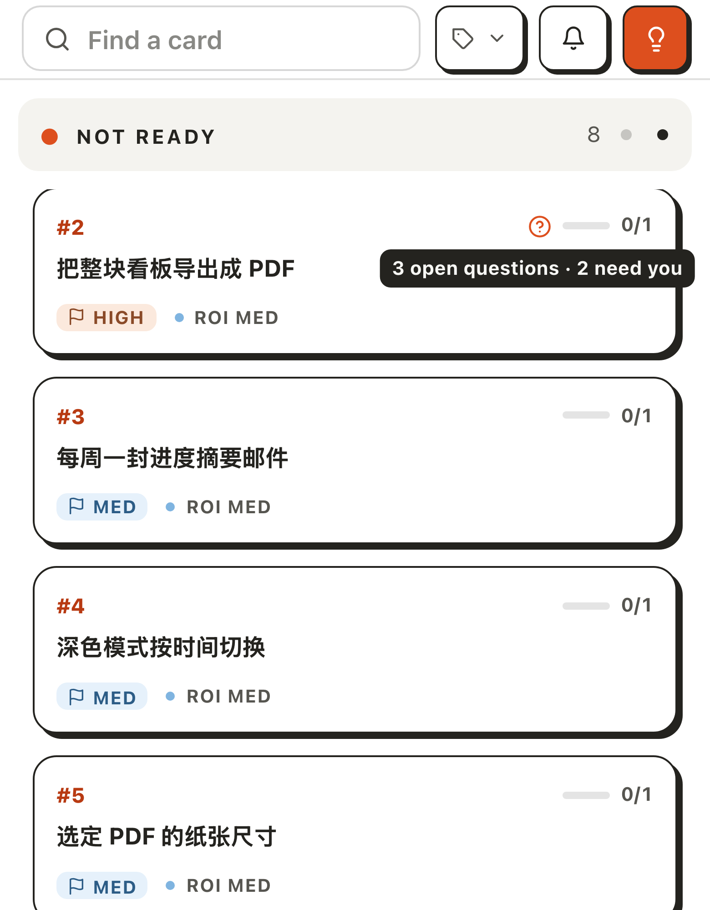
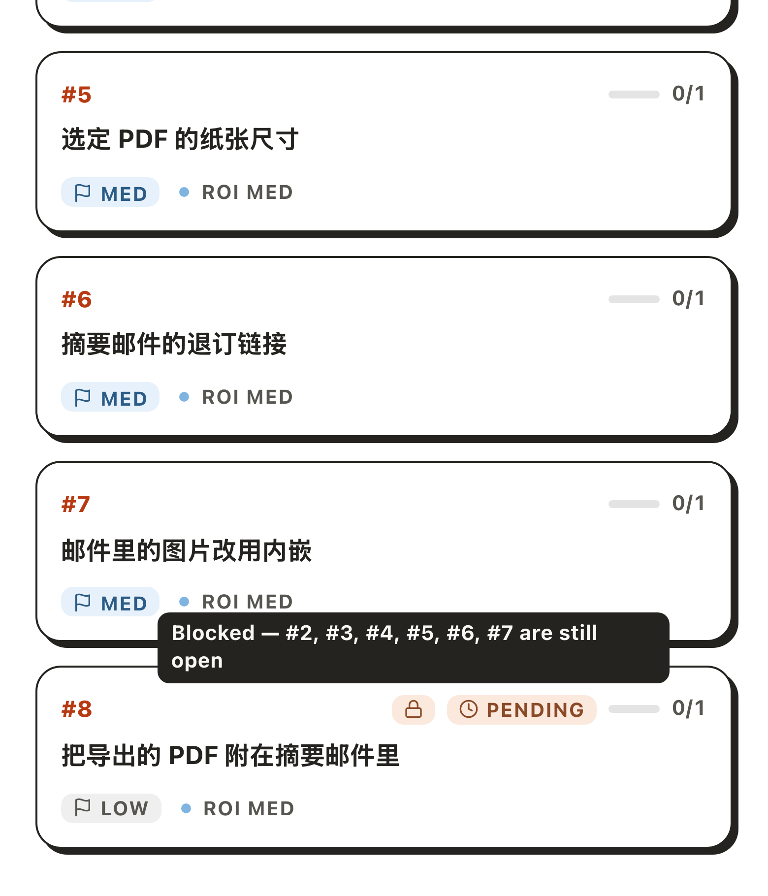
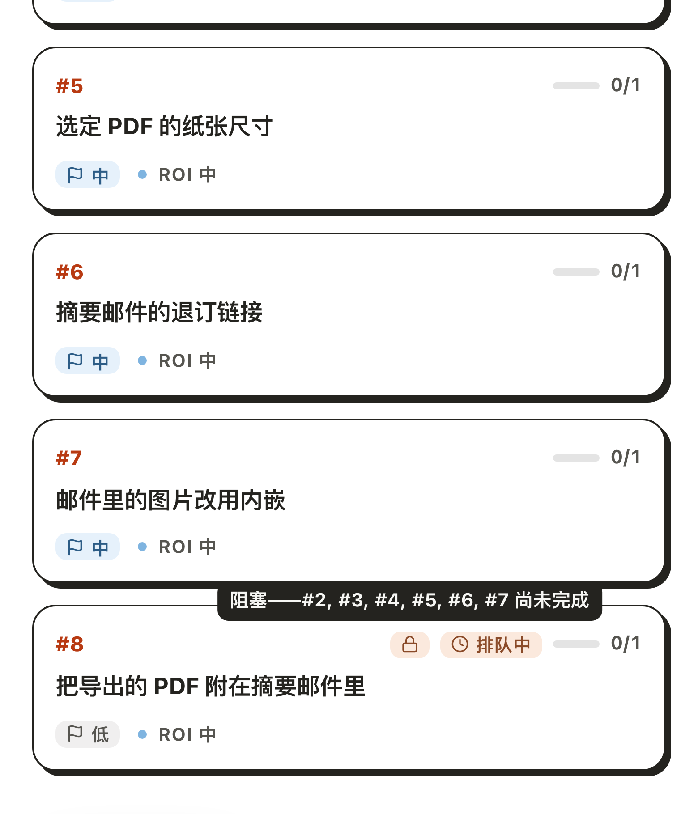

# 在手机看板上读卡片标记的提示气泡

## Setup

- **看板**：一个刚用 `akb install` 建好的看板（自带 #1），再用 `akb raw create` 建七张卡：
  - #2「把整块看板导出成 PDF」，优先级高，带三个待澄清问题，前两个用 `akb raw tag 2 1,2 user` 标给用户。
  - #3–#7 五张普通卡，标题随意。
  - #8「把导出的 PDF 附在摘要邮件里」，优先级低，`--blocked-by 2,3,4,5,6,7`。
- **不要让看板够到 agent**：启动看板 UI 的环境里 `PATH` 只留 `node`，否则新卡会被自动细化，卡片上的标记就变了。
- **界面**：在手机宽度（390×844）的触屏浏览器里打开看板 UI（`kanban-ui`）的 `/`，关掉「获取应用」横幅。第 1–5 步界面语言为英文，第 6 步为中文（换语言要重启看板 UI）。

## Steps

1. 向左滑到第二列「Not ready」。
   八张卡都在这一列；#2 右上有一个橙色问号，没有任何气泡。
   

2. 按住 #2 的问号不放。
   问号上方出现气泡「3 open questions · 2 need you」，一行；问号离屏幕右缘不到 100px，气泡向左让了一点，右边留着 8px，文字完整。
   

3. 抬起手指。
   #2 的卡片页打开，气泡随之消失：卡片本身是一个链接，点在标记上也算点了卡片。
   

4. 回到看板的「Not ready」一列，往上滑到 #2 顶到这一列的上沿，再按住问号不放。
   上方已经没有空间，气泡改在问号下方打开，同样留在屏幕内。
   

5. 手指滑开，把这一列滑到底，按住 #8 的锁形标记不放。
   气泡「Blocked — #2, #3, #4, #5, #6, #7 are still open」比 260px 宽，换成两行、左对齐，四边都在屏幕内。
   

6. 换成中文界面，重复第 5 步。
   同一条提示「阻塞——#2, #3, #4, #5, #6, #7 尚未完成」一行放得下，保持一行。
   

## Feedback

- **气泡确实不再出界**：贴着右缘的、顶到列上沿的、比屏幕还宽的，三种情况都读得全，位置也自然，看不出是「挪过」的。
- **但在看板上你留不住它**：卡片整张是链接，手指一抬就进了卡片页。想读气泡只能按住不放，或者按下后滑开；这两种手势没有任何提示，#1371 说的「点一下就留住」在看板卡片上并不成立。
- **「未完成」标记的气泡基本读不到**：点它会立刻弹出运行记录对话框，把气泡整个盖住。这条英文提示有 395px 宽，是这次换行最想解决的那一条；实跑时量到它确实换成了两行、留在屏幕内，但用户只在按住的那一瞬间看得到。
- **手指会挡住标记**：气泡在标记上方 6px，按住时指尖正好压在两者之间；改到下方打开时（第 4 步）气泡基本就在手指底下。
- **气泡会盖住相邻内容**：第 2 步盖住上一张卡的下边框，第 4 步盖住自己这张卡的标题，第 5 步的两行气泡盖住上一张卡的 ROI 一行。
- **卡片页上的气泡是多余的**：#8 卡片页的「refine · waiting on …」标记本身已经写全了文字，点它弹出的气泡是同一句话，还盖住了标题。
- **证据的局限**：用的是无头 Chrome 的触摸模拟，不是真机。模拟里长按后抬手照样触发点击；真机上长按链接通常会弹出系统菜单，没有验证。截图是按住期间截的，同时读了 DOM：被按的标记带 `data-tip-held`，气泡的包围盒在可见范围内。
- **没有跑到的**：云端看板（`cloud-ui`）、触控笔、旋转屏幕后重新摆放、任务组标记、通知面板的静音提示、待筛选页的判断原因标记。
