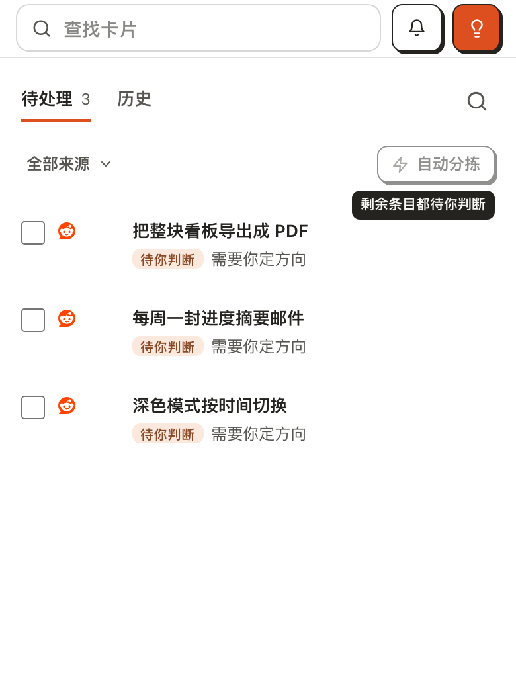
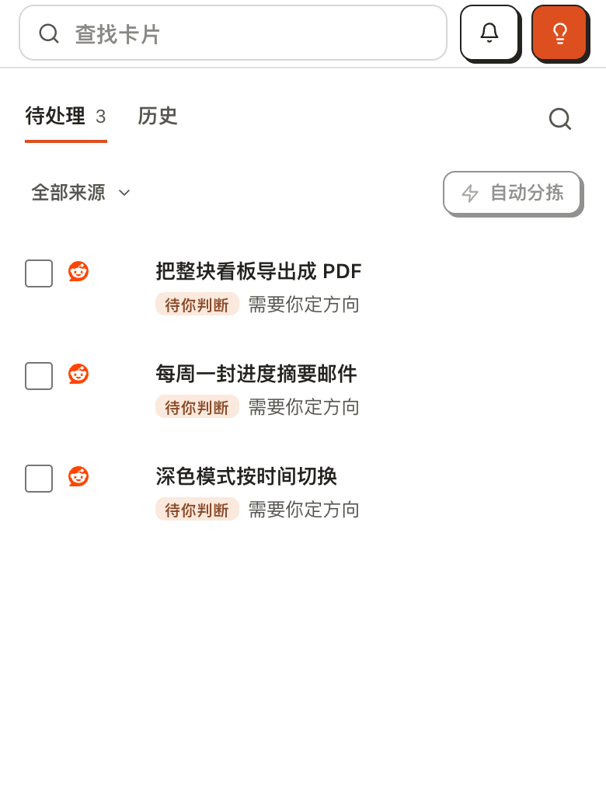
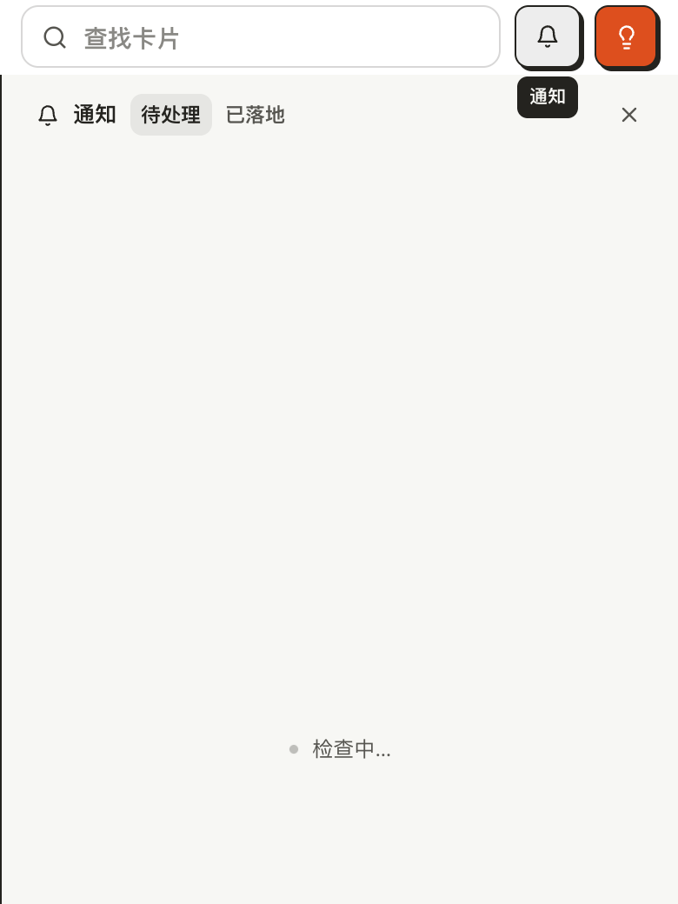
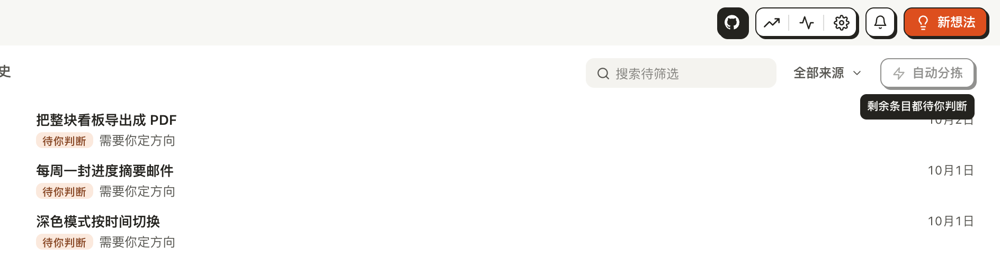
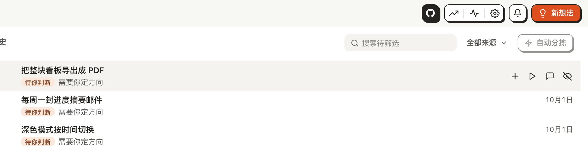

# 在触屏上点一下读提示气泡

## Setup

- **看板**：一个刚用 `akb install` 建好的看板，界面语言为中文。`docs/kanban/triage/` 下放三个待筛选条目，都已被分拣留给用户判断，例如：

  ```markdown
  ---
  source_id: "sample-1"
  title: "把整块看板导出成 PDF"
  source_type: reddit
  collected_at: "2026-10-02T09:00:00Z"
  imported_at: "2026-10-02T09:30:00Z"
  verdict: human-review
  verdict_reason: needs-user
  ---

  每周例会要把看板投到会议纪要里，现在只能截图。
  ```

  另两个是「每周一封进度摘要邮件」和「深色模式按时间切换」，字段相同。
- **账号**：一个 Pro 账号，否则「自动分拣」显示的是锁而不是变灰。没有真账号时用本目录的 `stand-in.mjs` 顶替 Cloud：`node stand-in.mjs 4372 <AI4KANBAN_HOME>`，再带着 `AI4KANBAN_CLOUD_URL=http://127.0.0.1:4372`、`AI4KANBAN_SUPABASE_URL=http://127.0.0.1:4372`、`AI4KANBAN_SUPABASE_ANON_KEY=anon` 启动看板 UI。账号是虚构的。
- **界面**：在手机宽度（390px）的触屏浏览器里打开看板 UI（`kanban-ui`）的 `/inbox`，关掉「获取应用」横幅。第 6、7 步换成 1280px 宽的窗口和鼠标。

## Steps

1. 打开待筛选页。
   三个条目都标着「待你判断」；右上的「自动分拣」是灰的，旁边没有任何说明。
   

2. 点一下变灰的「自动分拣」，手指抬起。
   按钮下方出现气泡「剩余条目都待你判断」，抬手 1.5 秒后仍在；气泡贴着按钮右缘，没有被屏幕右边截断。
   

3. 再点一下「自动分拣」。
   气泡保持显示，不会像开关一样收起。
   

4. 点列表下方的空白处。
   气泡消失。
   

5. 再点「自动分拣」让气泡出现，然后点顶栏的铃铛。
   「自动分拣」的气泡消失，铃铛下方出现气泡「通知」；铃铛照常工作，通知面板打开。同一时间只有一个气泡。
   

6. 换到 1280px 宽的窗口，用鼠标点一下变灰的「自动分拣」，指针不动。
   气泡在，因为指针还悬停在按钮上。
   

7. 把指针移到别处。
   气泡消失：鼠标点击不会让气泡停留。
   

## Feedback

- **终于读得到**：变灰的「自动分拣」以前在手机上没有任何解释，现在点一下就有一句完整的话，而且留得住，够时间读完。
- **没有人告诉你可以点**：灰按钮看起来就是「不能按」，没有问号、下划线或任何提示它点了会说话；知道要去点一个禁用按钮的人不多。
- **点完按钮气泡赖着不走**：点铃铛后「通知」两个字盖在刚打开的面板顶栏上，直到下一次点按才消失。面板已经写着「通知」，这个气泡纯属多余，还挡了一点内容。
- **收起只有一种办法**：没有关闭按钮也不会自动消失，只能再点别处；点到的如果恰好是另一个控件，就顺带触发了它。
- **点按的气泡比悬停的矮一点**：#1394 之后点按打开的气泡高 21.6px（原先约 24px），位置和文字不变；第 2 步里它贴着按钮右缘、没有被挪动，两种打开方式并排看才看得出差别。
- **桌面上气泡会压住内容**：第 6 步里气泡盖住了第一行条目的日期（不是这次改动带来的）。
- **通知面板一直「检查中…」**：在这个临时看板上等了 6 秒仍未结束，与本用例无关，但第 5 步的截图因此是个空面板。
- **证据的局限**：这次用的是无头 Chrome 的触摸模拟，不是真机。模拟环境里点按后 `:hover` 也会粘住，所以单看截图分不清气泡是靠悬停还是靠这次的改动留住的；实跑时另外确认了被点的元素带上了 `data-tip-held` 标记、点别处后标记清除、且全页始终至多一个。iOS Safari 上的真实表现没有验证。
- **没有跑到的**：云端看板（`cloud-ui`）、触控笔、英文界面、气泡停留期间提示本身消失（如新条目进来后「自动分拣」恢复可用）、带触屏的电脑上鼠标与触摸混用，这次都没有验证。看板卡片上的标记见 `read-a-card-mark-tooltip-on-the-phone-board/`。
