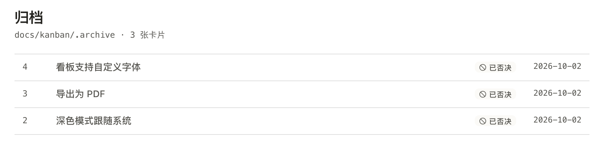
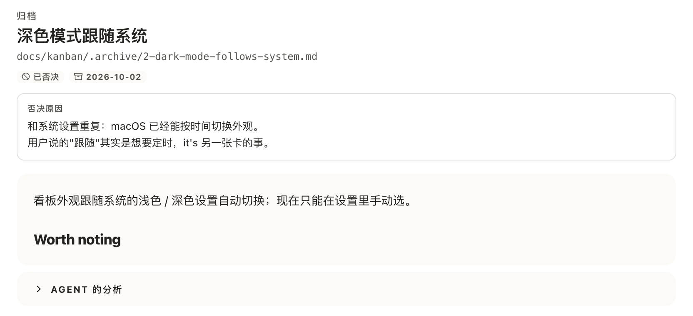
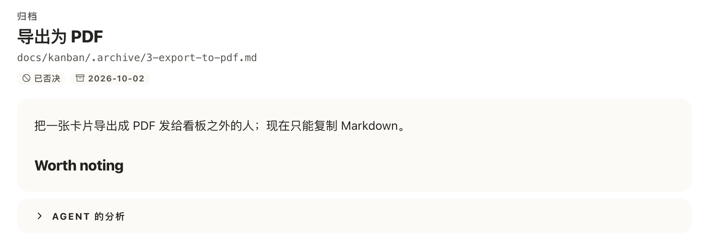
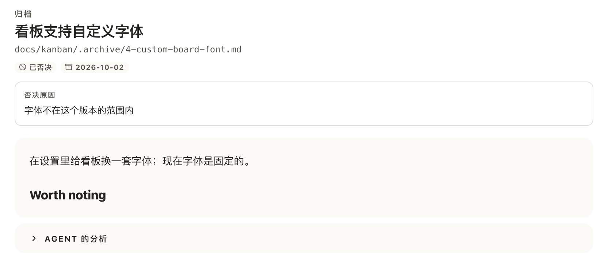

# 在归档里读一张被否决的卡的原因

## Setup

- **看板**：一个刚用 `akb install` 建好的看板，界面语言为中文，归档里有三张今天否决的卡：
  - #2「深色模式跟随系统」：`akb raw reject 2 --reason $'和系统设置重复：macOS 已经能按时间切换外观。\n用户说的"跟随"其实是想要定时，it\'s 另一张卡的事。'`
  - #3「导出为 PDF」：`akb raw reject 3 --discard`（没有原因）
  - #4「看板支持自定义字体」：`akb raw reject 4 --discard --reason "字体不在这个版本的范围内"`
- **界面**：在浏览器里打开看板 UI（`kanban-ui`）的 `/archive`，窗口宽 1280px。截图只截页面正文一栏。

## Steps

1. 打开归档页。
   三张卡各占一行，都是「已否决」标签加归档日期；列表里看不出哪张有原因。
   

2. 点「深色模式跟随系统」这一行。
   进入这张卡的归档页：「已否决」和日期标签下方有一个细线描边的圆角框，小标题「否决原因」在上，原文在下并占满整行；两行原文按原样换行，双引号和撇号都在。
   

3. 回到归档页，点「导出为 PDF」这一行。
   只有「已否决」和日期标签，标签下面直接是卡片正文，没有原因框。
   

4. 打开「看板支持自定义字体」（`/archive/4`）。
   丢弃时给了原因的卡同样显示原因框，一行原文。
   

## Feedback

- **一眼能读到**：原因就在标签下面、正文上面，位置对；原文不截断、换行保留，读起来就是当时写的那句话。
- **框太淡**：白底、发丝细线、10px 的小标题，夹在标签和灰底正文之间，像一条元信息而不是「这张卡为什么没做」的答案；它其实是这一页最值得看的内容。
- **列表里分不出来**：三行都是「已否决」，想找「当时写了原因的那张」只能一张张点开。
- **没原因的卡什么都不说**：丢弃的卡和这次改动之前否决的卡看起来一样，页面上看不出是「没写原因」还是「原因没保存」。
- **只读**：页面上不能改也不能删原因，写错了只能去改文件。
- **没有跑到的**：英文界面的「Reason」、很长的单行原因（无空格的长串换行）、分组里子任务页上的原因、窄屏宽度，这次都没有验证。
