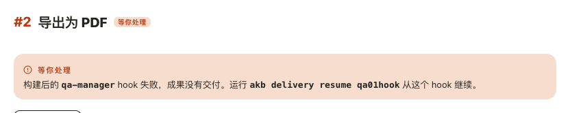
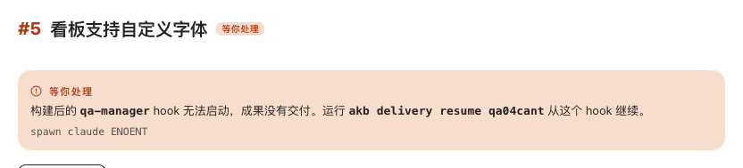
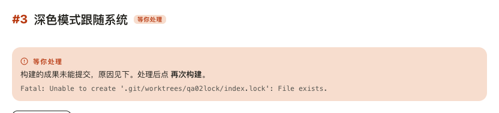
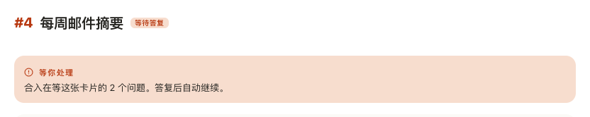
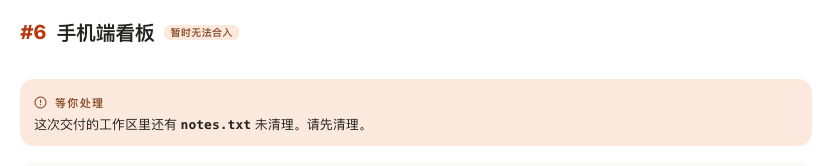
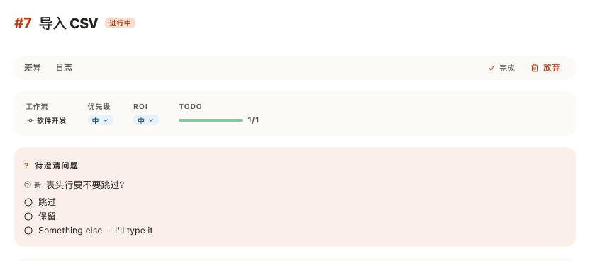
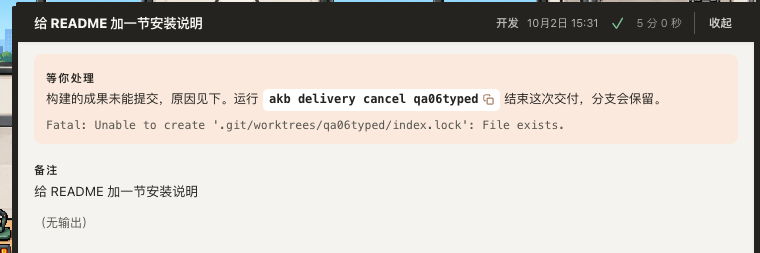
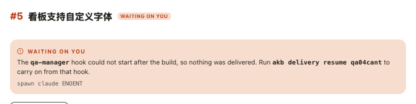
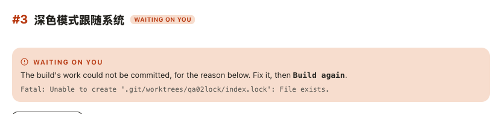
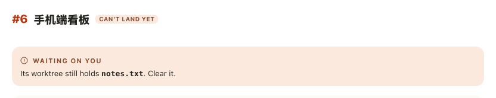

# 在卡片页读一次交付到了哪一步、为什么停下

## Setup

- **看板**：一个刚用 `akb install` 建好的 git 项目（分支 `main`），删掉 `docs/kanban/setup-checklist.md`，界面语言为中文；`akb` 在 PATH 上，没有任何 agent。
- **卡片**：#2–#7 六张，状态都是 `implementing`；#4 带两个待澄清问题，#7 带一个。建好后整个看板提交一次。
- **交付**：真实的构建要起 agent，这里用 `seed.mjs` 顶替——在项目目录执行 `node seed.mjs`，它给每次交付建一个真的工作区和分支，并把交付记录写进 `.akb/boards/docs/kanban/sessions.json`：

  | 交付 | 卡片 | 记录里写的 |
  | --- | --- | --- |
  | `qa01hook` | #2 | 构建后的 `qa-manager` hook 失败 |
  | `qa04cant` | #5 | 同一个 hook 无法启动，系统原文 `spawn claude ENOENT` |
  | `qa02lock` | #3 | 成果未能提交，git 原文 `fatal: Unable to create '…/index.lock': File exists` |
  | `qa03held` | #4 | 构建已完成，排队合入 |
  | `qa05left` | #6 | 构建已完成，排队合入；工作区里留了一个没提交的 `notes.txt` |
  | `qa07work` | #7 | 还在构建 |
  | `qa06typed` | 无卡片 | 成果未能提交，同上的 git 原文 |

- **界面**：在浏览器里打开看板 UI（`kanban-ui`），窗口宽 1280px；先开首页等十来秒，让看板自己走一轮合入——#4、#6 的原因是它那时写下的，不是种子写的。截图只截标题到提示框一段。

## Steps

1. 打开 `/2`。
   标题旁的徽标是「等你处理」；下面的提示框标签同样是「等你处理」，正文：「构建后的 `qa-manager` hook 失败，成果没有交付。运行 `akb delivery resume qa01hook` 从这个 hook 继续。」
   

2. 打开 `/5`。
   同一句换成「无法启动」，下面另起一行等宽小字照写系统原文 `spawn claude ENOENT`。
   

3. 打开 `/3`。
   正文是「构建的成果未能提交，原因见下。处理后点 `再次构建`。」，下一行是 git 的英文原文。
   

4. 打开 `/4`。
   徽标是「等待答复」，正文：「合入在等这张卡片的 2 个问题。答复后自动继续。」
   

5. 打开 `/6`。
   徽标是「暂时无法合入」，正文：「这次交付的工作区里还有 `notes.txt` 未清理。请先清理。」
   

6. 打开 `/7`。
   徽标是「进行中」，标题下没有提示框。
   

7. 在 `/7` 把鼠标停在「待澄清问题」一栏上。
   浏览器自带的悬停提示是中文的同一句状态说明加出路：「正在按开工时批准的内容构建这张卡片，完成后合入 main。 先中止运行，然后「放弃」才能释放卡片。」无头浏览器截不到原生提示，证据是读出的 `title`。
   [悬停提示的文字](07-held-tooltip.log)

8. 回到首页，按右上角「运行历史」，点沙发上标着「开发」的小人。
   展开的运行面板顶部是「等你处理」，正文：「构建的成果未能提交，原因见下。运行 `akb delivery cancel qa06typed` 结束这次交付，分支会保留。」命令旁有复制按钮，下一行是 git 原文。
   

9. 把界面语言换成英文后重启看板 UI，打开 `/5`。
   徽标和标签都是 `WAITING ON YOU`，正文：`The qa-manager hook could not start after the build, so nothing was delivered. Run akb delivery resume qa04cant to carry on from that hook.`，原文一行不变。
   

10. 打开 `/3`。
    正文：`The build's work could not be committed, for the reason below. Fix it, then Build again.`，git 原文与中文界面下逐字相同。
    

11. 打开 `/6`。
    徽标是 `CAN'T LAND YET`，正文：`Its worktree still holds notes.txt. Clear it.`
    

12. 界面语言仍是中文时，在终端对 #2、#6、#4 执行 `akb raw archive <id>`。
    三次都被拒绝，引用的状态说明仍是英文原句，例如 ``The `qa-manager` hook failed after the build, so nothing was delivered.``
    [终端输出](12-terminal.log)

## Feedback

- **终于整句是中文**：徽标、提示框、出路一眼读完，不用再在中文界面里啃一段英文；文件名、交付号、命令保持原样并加粗，要抄的东西很好找。
- **「原因见下」好用**：看板说不清的原因先给一句中文概括，原文单独一行小字，既知道该干什么，又能拿原文去搜。
- **原文其实被动过**：git 的 `fatal: …` 显示成了 `Fatal: … File exists.`——首字母被改成大写、句末多了一个句号，拿去搜索或对照日志时对不上。
- **徽标和标签各说各的**：#4 徽标是「等待答复」、#6 是「暂时无法合入」，提示框标签却都是「等你处理」；只有停下的那几种两处一致。
- **hook 停下时按钮和句子指向不同**：句子让人去终端运行 `akb delivery resume …`，正下方却是一个醒目的「再次构建」按钮，卡片页上这条命令也没有复制按钮（运行历史里有）。
- **「hook」没有译**：中文句子里夹着 `hook` 一词，不熟悉看板的人未必知道指什么。
- **悬停提示有个多余空格**：「…合入 main。 先中止运行…」两句之间多了一个半角空格；而且它是浏览器原生提示，要停一秒才出来，触屏上读不到。
- **「进行中」什么都不多说**：正在构建时标题下没有任何说明，那句「正在按开工时批准的内容构建…」只藏在问题栏的悬停提示里；卡片没有问题时就完全看不到。
- **问题栏里还有英文**：选项「Something else — I'll type it」在中文界面下没有译（不是这次改的范围，但就挨着新译好的句子）。
- **没有跑到的**：等待重试、正在解决冲突、目标分支变动、排队、已合入、等你提交这几种要真的合入过程才出现，这次没有造；命令的复制按钮没有点；升级前留下的旧记录（没有种类）按英文原文显示这一条没有验证；托管卡片页（`cloud-ui`）没有跑。
