# 在工作流里让一个 Agent 定期运行

## Setup

- **看板**：一个刚用 `akb install` 建好的看板（项目是 git 仓库），删掉 `docs/kanban/setup-checklist.md`，界面语言为中文；工作流是内置的「软件开发」，还没有自建 Agent。
- **Agent**：用 [`skill/run-a-workflow-agent-on-a-schedule/stand-in.mjs`](../../skill/run-a-workflow-agent-on-a-schedule/stand-in.mjs) 顶替真实的 Agent（不需要账号），写法见那个用例的 Setup；被定期运行启动时它往 `CHANGELOG.md` 加一行。
- **界面**：这次构建的 `kanban-ui`（`AI4KANBAN_CLI` 指向这次构建出的 `cli/dist/kanban.mjs`），在浏览器里打开看板，窗口 1280×1000。截图只截「配置」或「运行历史」窗口。
- **英文界面（第 11、12 步）**：把界面语言换成 English 后重开同一个看板。

## Steps

1. 点右上角的「配置」，再点左栏的「工作流」。
   「规划」「执行」两个分组框下面多一个「定期运行」框，没有箭头和上面相连；框里一行小字「到点自己运行，不随卡片」，右端一个「+」，下面写着「还没有定期运行的 Agent。」
   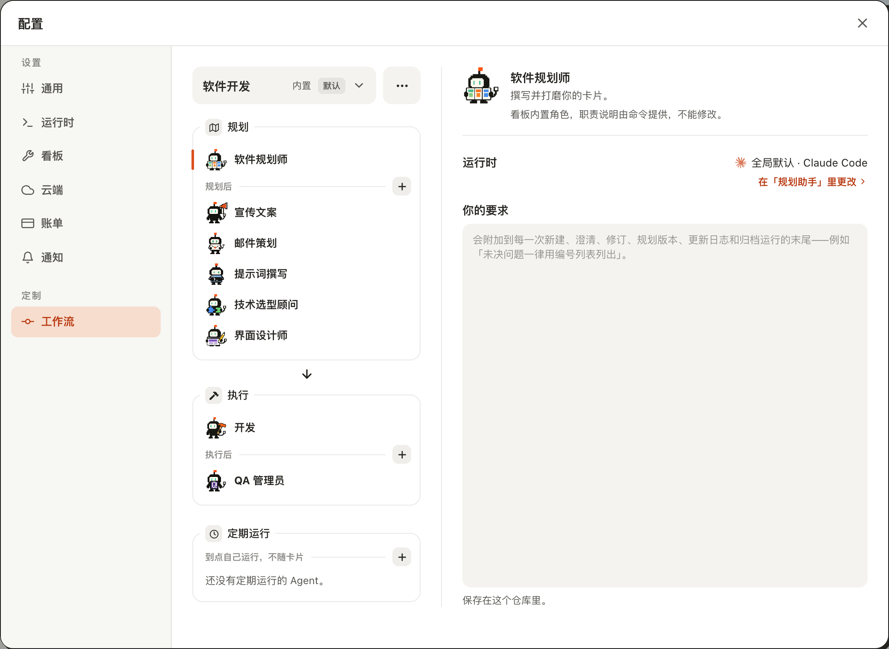

2. 点「定期运行」框里的「+」。
   框里出现新建行：虚线空头像位、已聚焦的名称输入、变淡的「创建」，行下小字「小写字母，用短横线连接」；「+」变成「×」，空状态那句话消失。
   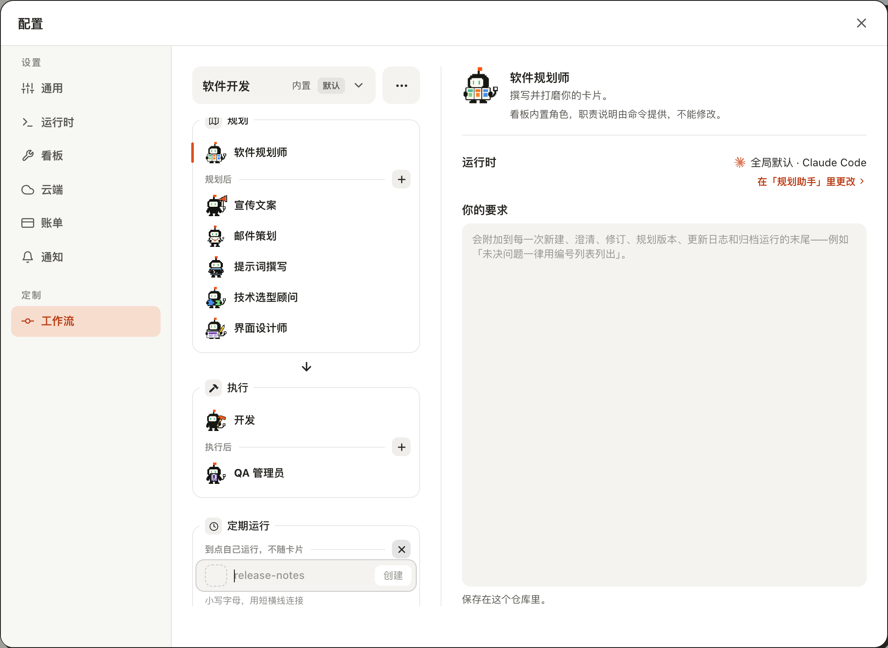

3. 输入 `changelog-keeper`，按回车。
   框里多出「Changelog keeper」并被选中。右侧名称行有三个控件：周期小控件「每天」、「立即运行」、「删除」；描述下面一行「尚未运行 · 首次运行 <明天此刻> 之后」；再往下是它的 `AGENT.md`，里面写着 `hook: schedule`。
   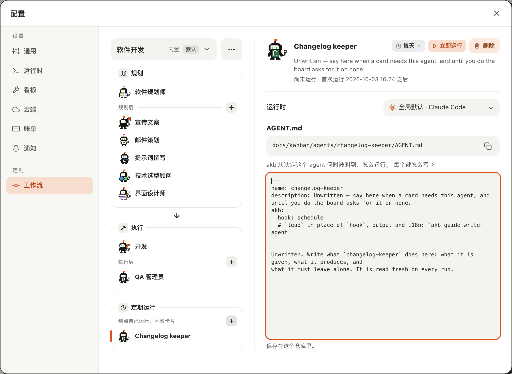

4. 点周期小控件「每天」。
   弹出一个窄菜单：「每 6 小时」「每天」（打勾）「每 7 天」「自定义」，分隔线下面最后一项是棕红色的「停用」。
   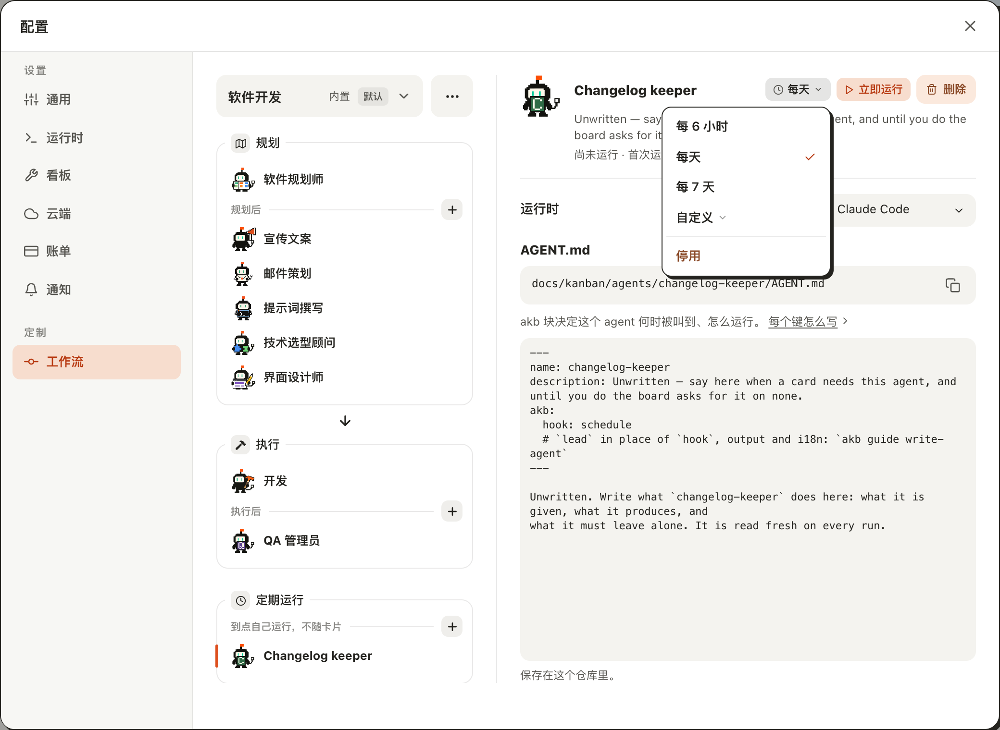

5. 选「每 6 小时」。
   菜单收起，小控件变成「每 6 小时」，下面那行变成「尚未运行 · 首次运行 <六小时后> 之后」。
   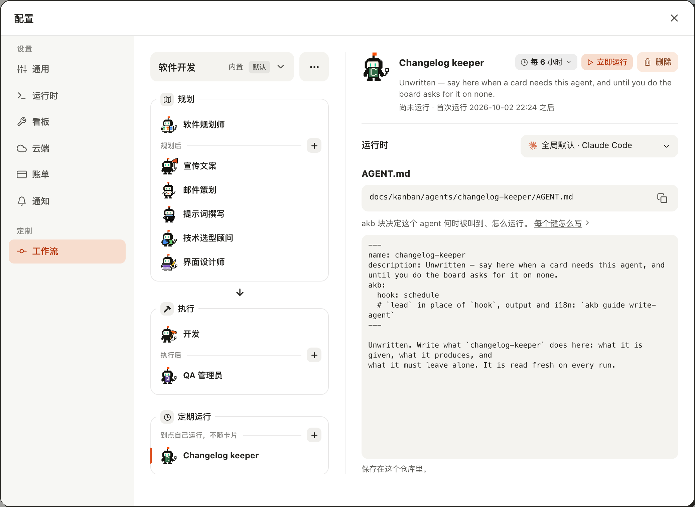

6. 点「立即运行」。
   按钮变成不可点的「运行中…」；几秒后变回「立即运行」，下面那行变成「上次运行 <刚才> · 下次运行 <六小时后> 之后」。项目里多出一个提交 `changelog-keeper: scheduled run (Coding)`。
   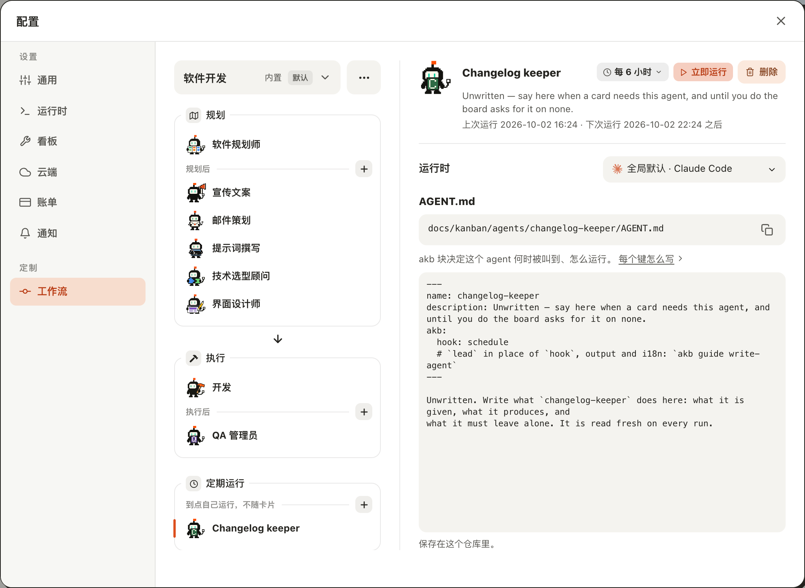

7. 关掉「配置」，点右上角的「运行历史」，再点场景里标着「Changelog keeper / 定期运行」的小人。
   展开的面板标题是「软件开发 · Changelog keeper」，右边写着「定期运行」、开始时间和对勾；正文是这次运行说的话。
   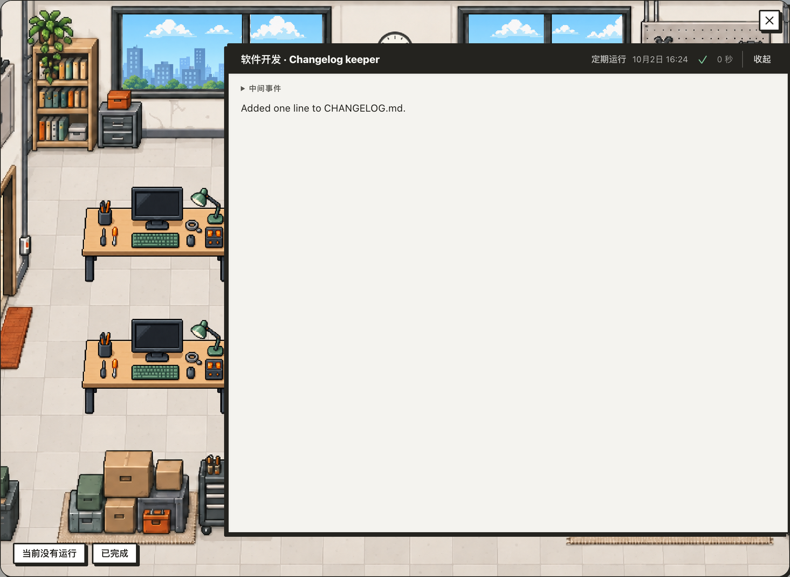

8. 回到「配置 → 工作流」，选中「Changelog keeper」，点周期小控件，选「停用」。
   小控件变成「已停用」，「立即运行」变淡、点了没有反应；下面那行只剩「上次运行 <时刻>」。左边它移到框里的「已停用 (1)」小标题下，头像变灰。
   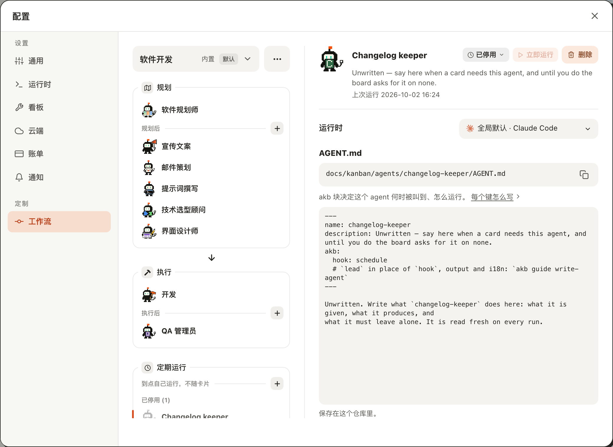

9. 再点小控件。
   菜单里只有四个周期选项，没有一项打勾，也没有「停用」。
   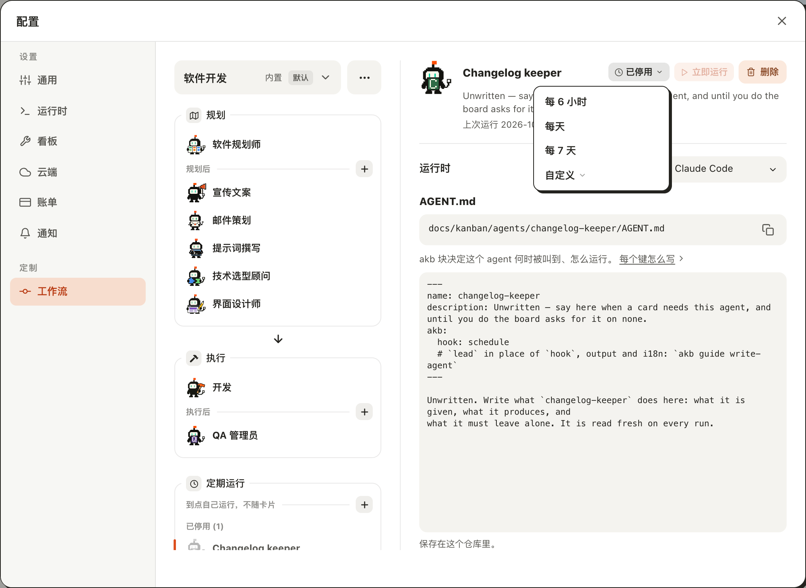

10. 选「每天」。
    Agent 重新启用：小控件是「每天」，「立即运行」可点，下面那行是「上次运行 <时刻> · 下次运行 <明天此刻> 之后」；左边回到「到点自己运行，不随卡片」下面，「已停用」小标题消失。
    

11. 用英文界面打开同一页。
    框叫「Scheduled」，小字「Runs on its own, not per card」；控件是「Every day」「Run now」「Delete」，那一行是「Last run … · Next run after …」。
    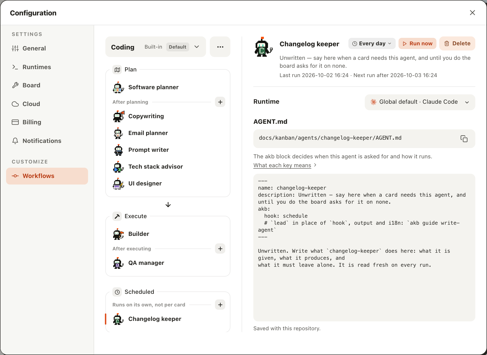

12. 点「Every day」。
    菜单是「Every 6 hours」「Every day」（打勾）「Every 7 days」「Custom」，最后一项「Disable」。
    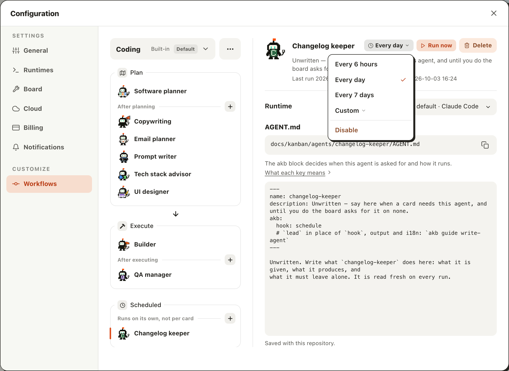

## Feedback

- **不用学新东西**：「+」、新建行、选中后的详情页都和上面两个框一样；周期和停用收在一个小控件里，名称行很干净。
- **「定期运行」框在屏幕底下**：1280×1000 的窗口里它的下边框就已经被裁掉，停用后的那一行只露出半截（见第 8 步的截图）；窗口再矮一点，新建的 Agent 要滚动才看得到，而这一列没有任何「下面还有」的提示。
- **「停用」藏得深**：要先想到「停用是一种周期」才会去点周期小控件；上面两个框里的 Agent 是名称行上一个直接的「停用」按钮，同一页两种做法。菜单里它紧挨着「自定义」，颜色是唯一的区分。
- **「之后」读起来别扭**：「首次运行 2026-10-03 16:24 之后」像是话没说完；知道是「不早于这个时刻」的人才读得顺。
- **新建完是个半成品却能马上跑**：`AGENT.md` 还是「Unwritten — …」的英文占位，「立即运行」已经可点，点了就真的起一次运行；没有任何「先写规则」的提醒。新建后它默认每天运行，明天此刻就会带着占位规则自己跑一遍。
- **名称占位符还是 `release-notes`**：在「定期运行」框里新建，提示的示例名和上面两个框一样，没有给出一个像周期任务的名字。
- **运行中看不出进度**：按下后只有「运行中…」，没有去「运行历史」的入口；失败时按钮旁边会不会有标记，这次没有跑到。
- **运行历史里要点小人才知道是谁**：场景里小人的标签只有「Changelog keeper / 定期运行」，工作流的名字要展开面板才看到；面板标题「软件开发 · Changelog keeper」清楚。
- **提交了什么界面上不说**：运行结束后那一行只更新时间，不提这一遍有没有改动、提交是哪个；要去 git 里看。
- **没有跑到的**：「额外要求」框和它的范围「软件开发 · 定期运行」——这个框只对命令自带的 Agent 显示，而这次构建没有自带任何周期 Agent，自建的 Agent 页面上没有它；「自定义」周期的编辑区（菜单加宽）；运行失败后的界面；手机宽度；看板级周期 Agent（「配置 → 看板」）那个跟着变窄的同款菜单。
