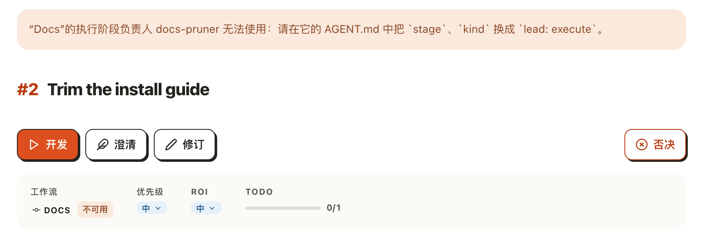
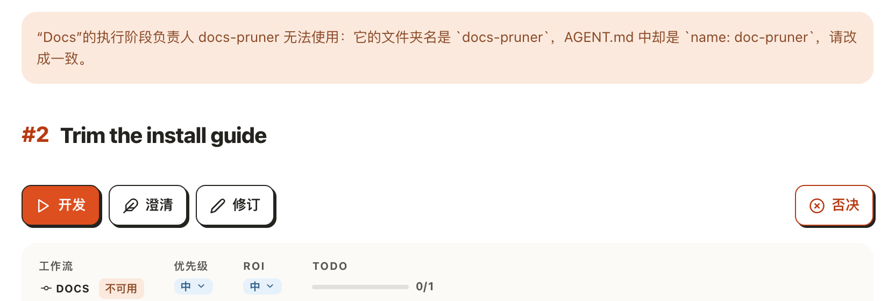
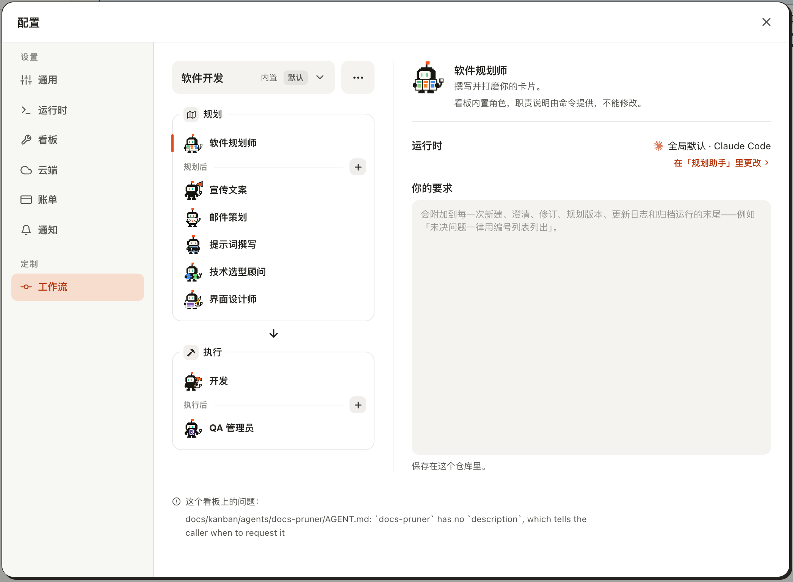
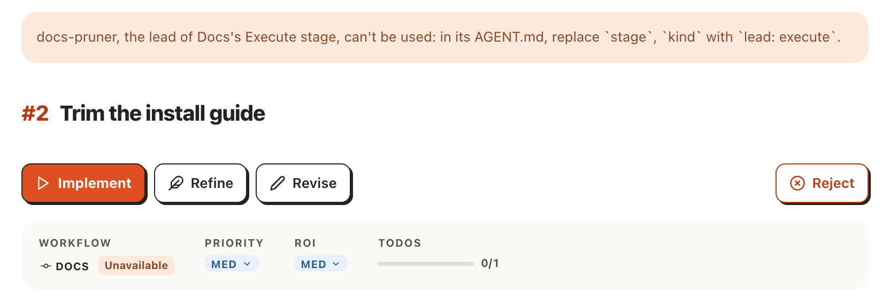

# 在卡片页按「执行」，而它的工作流负责人文件被看板拒用

## Setup

- **看板**：一个刚用 `akb install` 建好的看板，删掉 `docs/kanban/setup-checklist.md`，界面语言为中文。
- **Agent**：`docs/kanban/agents/docs-pruner/AGENT.md`，`name: docs-pruner`、一行 `description`，`akb:` 下是旧写法 `stage: execute` 加 `kind: lead`；另有一个写法正确的规划负责人 `docs-planner`（`lead: plan`）。软件规划师只属于「软件开发」，不能拿来领自建工作流。
- **工作流**：`Docs`（`wf-2`），规划阶段负责人 `docs-planner`，执行阶段负责人 `docs-pruner`。
- **卡片**：#2「Trim the install guide」，工作流为 `Docs`，状态还是 `todo`。
- **界面**：在浏览器里打开看板 UI（`kanban-ui`）的 `/2`，窗口宽 1280px。截图只截页面正文一栏。

## Steps

1. 按「执行」，在弹出的对话框里勾选「我知道方案可能还不完善。」。
   卡片上工作流 `DOCS` 旁已有「不可用」标签；对话框的「仍然执行」变为可按。
   

2. 按「仍然执行」。
   对话框关闭，什么都没启动；标题上方出现一条浅红提示：「「Docs」的「执行」阶段负责 Agent docs-pruner 无法使用：请在它的 AGENT.md 中把 \`stage\`、\`kind\` 换成 \`lead: execute\`。」
   

3. 删掉 `AGENT.md`、留下空文件夹，刷新后重做第 1、2 步。
   提示的后半句换成「它的文件夹中缺少 AGENT.md，请补上。」
   

4. 放回新写法（`lead: execute`）的文件，但把 `name` 写成 `doc-pruner`，刷新后重做。
   后半句换成「它的文件夹名是 \`docs-pruner\`，AGENT.md 中却是 \`name: doc-pruner\`，请改成一致。」
   

5. 把 `name` 改成内置角色名 `builder`，刷新后重做。
   后半句换成「它与另一个 Agent 重名，请为其中一个改名。」
   

6. 把 `name` 改回 `docs-pruner`、删掉 `description` 一行，刷新后重做。
   后半句换成「它的 AGENT.md 有错误，详情见「配置 → 工作流」。」
   

7. 按右上角齿轮「配置」，选「工作流」。
   页面底部「这个看板上的问题：」下面是这份文件的英文原句：``docs/kanban/agents/docs-pruner/AGENT.md: `docs-pruner` has no `description`, …``
   

8. 关掉配置，删掉整个 `docs-pruner` 文件夹，刷新后重做第 1、2 步。
   回到原来那句：「「Docs」的「执行」阶段指定了 docs-pruner，但看板中没有该 Agent。」
   

9. 放回 Setup 里的文件并照第 2 步的提示改那一行，刷新。
   `DOCS` 旁的「不可用」标签消失。
   

10. 把文件改回旧写法，界面语言换成英文后重启，按「Build」→ 勾选 →「Build anyway」。
    提示是英文的同一句：``docs-pruner, the lead of Docs's Execute stage, can't be used: in its AGENT.md, replace `stage`, `kind` with `lead: execute`.``
    

## Feedback

- **一句话就知道改哪**：旧写法的提示直接给出要去掉的键和要换成的那一行，照改、刷新，「不可用」就没了。
- **反引号原样露出来**：提示里的 \`stage\`、\`lead: execute\` 没渲染成代码样式，字面的反引号直接显示，像没处理完的文本；英文界面同样如此。
- **不说文件在哪**：界面只说「它的 AGENT.md」，不像命令行那样给路径，得自己知道去 `docs/kanban/agents/docs-pruner/` 找。
- **要先过一道确认才看到原因**：卡片上早挂着「不可用」，却要按「执行」、勾选、再按「仍然执行」才说为什么；「不可用」标签本身点不出这句话。
- **提示离按钮远、不会自己消失**：它出现在标题上方而不是按钮旁边，改好文件后要刷新页面才消失。
- **重名那句不说和谁重**：撞的是内置角色 `builder`，「请为其中一个改名」其实只能改自己这个。
- **「其他错误」要多走一步，落点还是英文**：原因在「配置 → 工作流」最底部的小字里，是英文原句；首屏停在「软件开发」工作流上，不往下看会以为没有东西。
- **英文句子仍别扭**：`Docs's`（命令行写的是 `Docs'`）和句中大写的 `Execute stage`；中文句子「「Docs」的「执行」阶段负责 Agent」连着两对直角引号，读起来也有点挤。
- **规划负责人得自己写**：Setup 里原先借软件规划师领规划，现在不行了，得先写一个 `docs-planner`；对只想试一下自建工作流的人多了一道门槛。
- **没有跑到的**：「细化」按钮上的同一提示、看板首页卡片上的开始入口、英文界面的其余四种原因、改好之后真正启动一次运行，这次都没有验证。
