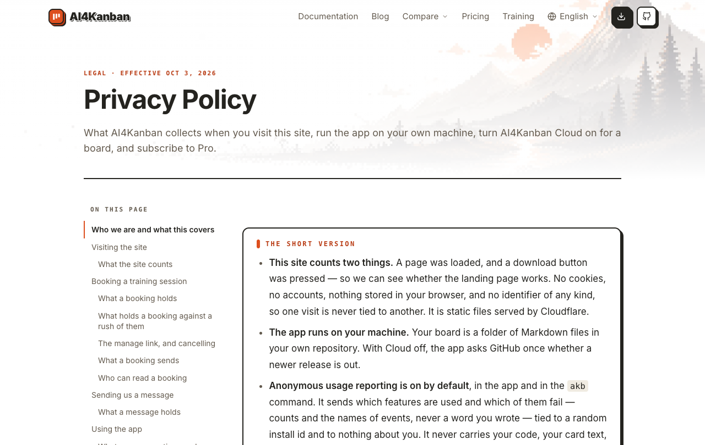
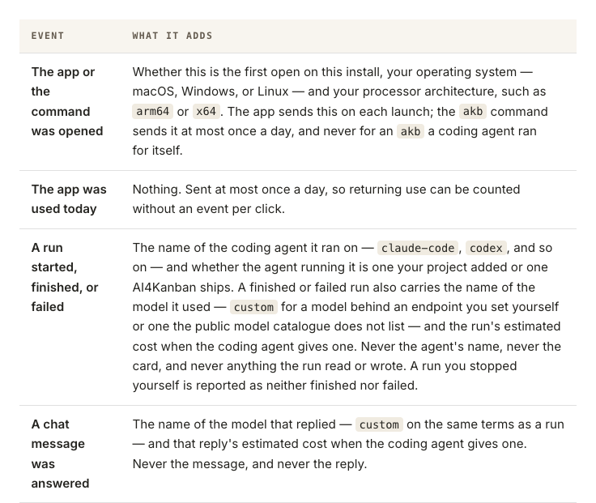

# 在隐私页查聊天回话会上报什么

## Setup

- **站点**：官网（`web/`）在本地跑起来，浏览器打开 `/privacy`，窗口 1280×1000。
- **读者**：开着用量上报、在看板上和 Agent 对话（建卡、规划、讨论）的人，想知道一次对话会往外发什么。

## Steps

1. 打开隐私页 `/privacy`。
   顶部是「Privacy Policy」和生效日期，左侧「On this page」目录里「Using the app」下有一项「What usage reporting sends」。
   

2. 点目录里的「What usage reporting sends」，再往下滚到事件表。
   页面跳到这一节（地址栏带 `#what-usage-reporting-sends`）。事件表里聊天那一行叫「A chat message was answered」，写明上报回话所用模型的名字（自定义端点或公开目录里没有的模型报 `custom`，与运行同一规则）和这次回话的估算花费（编码 Agent 给出时），并说不带消息、也不带回复。紧挨在上面的「A run started, finished, or failed」一行对运行写的是同样的模型和花费规则。整页不再出现「A chat message was sent」。
   

## Feedback

- **一眼能对上**：聊天行直接引用运行行的 `custom` 规则，上下两行挨着，读者不必去别处找定义。
- **「answered」改得对**：事件名从「sent」换成「answered」，暗示的是回话结束时才发；但没有明说，读者不会知道回话中途退出应用时这条不计、看板自己发起的对话也不计。
- **花费的含义没说清**：「that reply's estimated cost」没写是这一轮自己的花费还是整个对话累计的，只有对照代码才知道是本轮。
- **难找**：这一节在一万多像素深的长页里，只能靠目录跳；跳过去后事件表还在下面将近一屏，第一眼看到的是七个公共字段的说明。
- **顶部「The short version」没提模型和花费**：只说「counts and the names of events, never a word you wrote」，只读摘要的人会以为上报里没有花费这类数值。
- **没有跑到的**：窄屏下的事件表、中文界面（隐私页只有英文版）。
