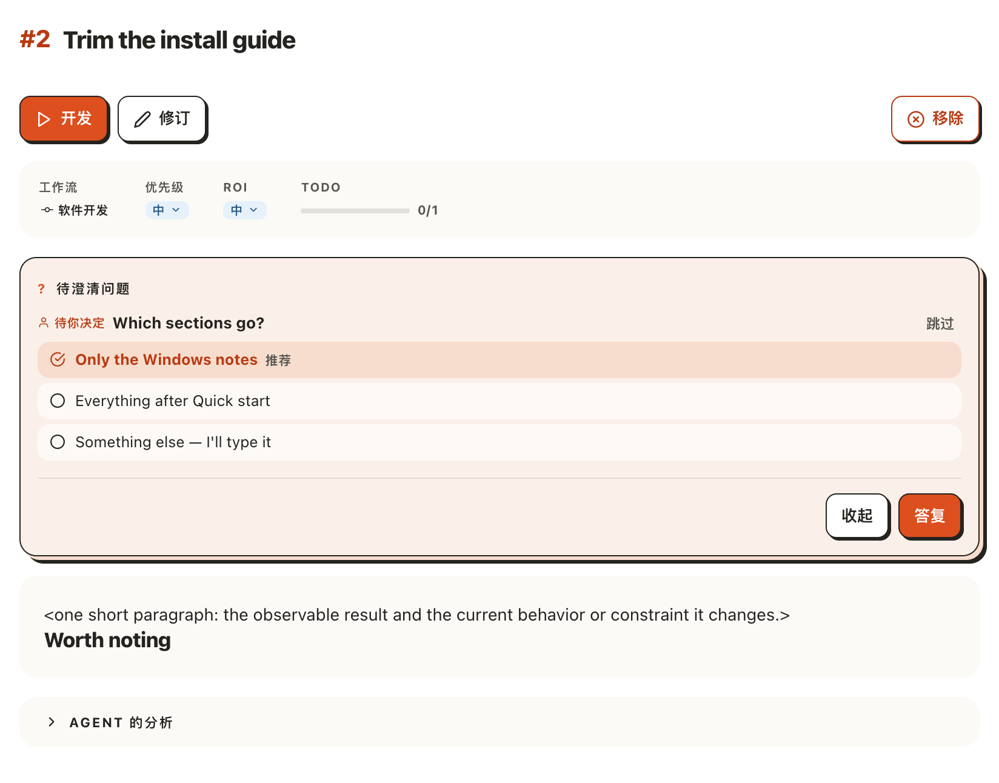
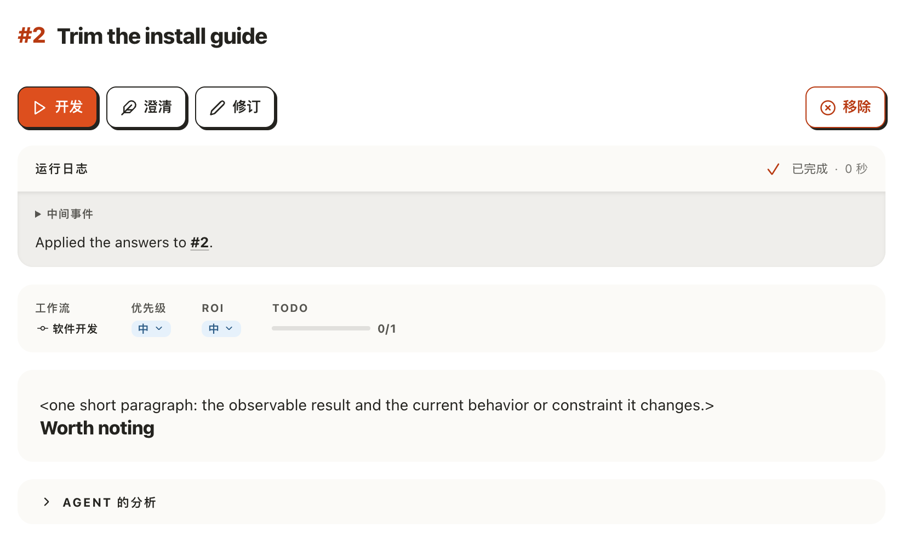
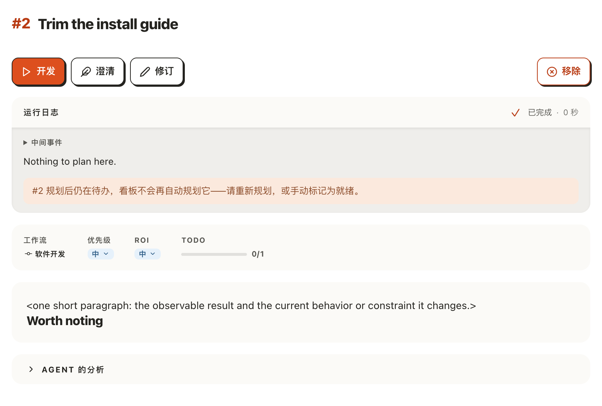

# 回答完卡片上最后一个问题，等看板自己细化它

## Setup

- **看板**：一个刚用 `akb install` 建好的看板，删掉 `docs/kanban/setup-checklist.md`，界面语言为中文。
- **卡片**：`akb raw create --title "Trim the install guide" --question "[user] Which sections go?" --recommended-option "Only the Windows notes" --option "Everything after Quick start"`，得到 #2——只带一个待用户决定的问题，状态 `todo`。
- **Agent**：用本目录的 [stand-in.mjs](stand-in.mjs) 顶替真实的 Agent（不需要账号）——在 `<project>/.akb/boards/docs/kanban/ui.config.json` 写 `{"harness":"claude-code","harnessSettings":{"claude-code":{"command":"node <路径>/stand-in.mjs <路径>/cli/bin/ai4kanban.mjs"}}}`。被要求应用回答时，它把已答的问题从卡片上去掉；被要求规划时，它什么都不改就结束。
- **界面（第 1–4 步）**：这次构建的 `kanban-ui`（`AI4KANBAN_CLI` 指向这次构建出的 `cli/dist/kanban.mjs`），在浏览器里打开 `/2`，窗口 1440×900，**先开着超过一分钟**再动手：看板的定时器每分钟走一次，第一次只记下当时已经可细化的卡。截图只截页面正文一栏。
- **终端（第 5–10 步）**：另建一个同样的新看板和同一张 #2，不开界面，也不配 Agent；用本目录的 [tick.mjs](tick.mjs) 顶替界面的定时器——它只打印看板此刻会自己启动什么，不启动任何东西，开始前先跑一次。日志里的 `akb` 就是这次构建出的命令；新看板每次都还想跑一次 `describe-product`，与本用例无关。

## Steps

1. 打开 `/2`，按「待澄清问题」右边的「作决定」。
   问题展开，推荐的「Only the Windows notes」已选中；操作栏里只有「开发」「修订」「移除」，没有「澄清」。
   

2. 按「答复」。
   一次应用回答的运行几秒内结束，问题从卡片上消失；操作栏里多出「澄清」，卡片仍是 `todo`，此刻没有任何运行。
   

3. 什么都不按，页面开着等两三分钟。
   看板自己启动了一次规划（这次是回答后 2 分 22 秒）。替身 Agent 什么都没改，运行结束后日志下面出现一行浅红提示：「#2 规划后仍在待办，看板不会再自动规划它——请重新规划，或手动标记为就绪。」
   

4. 页面继续开着，近四分钟（三四次定时）后执行 `akb run list`。
   #2 仍只有那一次 `clarify`，带着同一句原因（英文）；看板没有再试第二次。
   [04-once.log](04-once.log)

5. 换到终端的那个看板：问题还没回答时执行 `akb card refine 2`。
   什么都没启动（exit 1），原因是这张卡在等用户回答，并说明回答后看板会自己细化。
   [05-refine-refused.log](05-refine-refused.log)

6. 跑两次 `tick.mjs`。
   两次都没有 #2：等回答的卡不细化。
   [06-waiting.log](06-waiting.log)

7. 回答问题（`akb raw update-questions 2 --drop 1`），马上跑 `tick.mjs`。
   还是没有 #2：卡片文件刚改过，要静置两分钟。
   [07-just-answered.log](07-just-answered.log)

8. 两分钟后跑两次 `tick.mjs`。
   第一次交回 `{"action":"clarify","id":2,…}`，第二次没有：每张卡只自动一次。
   [08-refined.log](08-refined.log)

9. 再给 #2 加一个 `[user]` 问题，跑 `tick.mjs`；回答掉，两分钟后再跑两次。
   有问题时不取；答完后又被取一次，然后不再取。
   [09-asked-again.log](09-asked-again.log)

10. 新建三张卡：#3 什么都不带；#4 建好后先 `akb card refine 4 --print`；#5 `--blocked-by 3`。两分钟后跑两次 `tick.mjs`，再看 `sessions.json`。
    只有 #3 被取：#4 已在会话里细化过，#5 被 #3 挡着（建卡时已排好「前置卡完成后细化」）。`refined` 名单里是 1、2、4、3。
    [10-other-cards.log](10-other-cards.log)

## Feedback

- **终于不用盯着了**：答完问题走开，两三分钟后规划自己开始，这是这次改动最值的地方；以前这张卡会一直停在 `todo`。
- **等的那两三分钟没有任何提示**：答复之后页面上只多了一个「澄清」按钮，看不出看板马上要自己规划；心急的人会顺手按「澄清」，结果相同，但不知道其实不必按。
- **界面要开过一分钟才算数**：定时器第一次走只是记下「已有的旧卡」。按规则，刚打开界面就答题的话，这张卡会被当作旧卡记下，不会自动规划，页面上没有任何说明——这次实跑先等了一分钟避开，没有在界面上试这一种。
- **提示里的词和按钮对不上**：提示说「请重新规划」，按钮叫「澄清」，命令叫 `refine`，拒绝语说「refines」；同一件事四个说法。
- **「手动标记为就绪」没有入口可指**：提示让人自己标记为就绪，卡片页上却没有叫这个名字的按钮。
- **命令行的拒绝语清楚**：说了在等谁、之后会发生什么，比原来的 `a refine would not move #2` 好懂；但只用命令行、不开界面的看板并不会「自己细化」，这句话在那里是句空话。
- **`akb run list` 里的原因是英文且被截断**：界面是中文一整句，命令行只剩半句英文加省略号。
- **没有跑到的**：真实 Agent 的规划（这里是替身，所以规划必然「停在待办」）、英文界面的那句提示、细化失败（非正常结束）后不重试、Pro 工作流的卡被跳过、桌面应用里切到别的看板时不自动启动。
