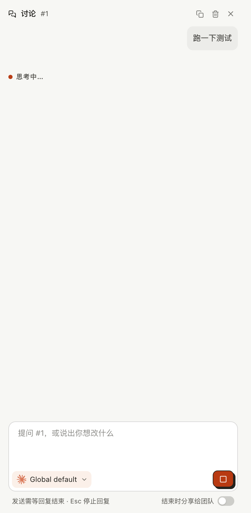
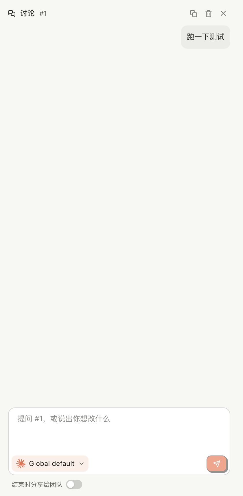

# 对话 Agent 还在跑命令时退出看板

## Setup

- **看板**：一个刚用 `akb install` 建好的看板，删掉 `docs/kanban/setup-checklist.md`；自带的 #1 就是聊的那张卡。
- **Agent**：用本目录的 [stand-in.mjs](stand-in.mjs) 顶替真实的对话 Agent（不需要账号）——在 `<project>/.akb/boards/docs/kanban/ui.config.json` 写 `{"harness":"claude-code","harnessSettings":{"claude-code":{"command":"node <路径>/stand-in.mjs"}}}`。它一收到消息就起两个命令：一个自成进程组的后台 `node`（相当于 Agent 放到后台的 `npm test &`）和一个前台 `sleep 600`，把 pid 写进项目目录的 `pids.json`，然后一直不回复。
- **看板界面**：这次构建的 `kanban-ui`（`next dev -p 7491`，`AI4KANBAN_CLI` 指向这次构建出的 `cli/dist/kanban.mjs`），自成一个进程组，和桌面应用启动它的方式一样；浏览器 1440×900。
- **终端**：zsh，在项目目录里；日志里的 `akb` 就是这次构建出的命令。另起一个与对话无关的 `node -e "setTimeout(() => {}, 600000)" &` 作对照。

## Steps

1. 打开 `/1`，点右上角「讨论」，输入「跑一下测试」并发送。
   消息出现在对话栏里，下面是「思考中…」，发送按钮变成停止按钮。
   

2. 回复还没结束时，在终端里 `cat pids.json`，再用 `ps` 看这几个进程。
   Agent 是看板服务（`next-server`）的子进程；后台的 `node` 自成一个进程组，`sleep` 和看板服务同组；自己起的那个 `node` 与它们无关。
   [02-running.log](02-running.log)

3. 退出看板：对看板服务的进程组发 `SIGTERM`（桌面应用退出、关掉最后一个窗口时做的就是这个）。
   看板服务不到一秒就退出，页面不再应答；Agent、后台的 `node`、`sleep` 全部消失，只剩自己起的那个 `node`。
   [03-quit.log](03-quit.log)

4. 重新启动看板，打开 `/1` 的「讨论」。
   对话里只有发出的那条「跑一下测试」，没有回复，也没有「思考中…」；发送按钮恢复可用。
   

5. 换成命令行：执行 `akb chat 1 "跑一下测试" --json &`，等 `pids.json` 写出后 `kill -TERM` 这个 `akb`。
   `akb` 以 143 退出，什么都没打印；Agent 和它的两个命令都已结束，自己起的 `node` 还在。
   [05-quit-akb-chat.log](05-quit-akb-chat.log)

6. 执行不带 `--json` 的 `akb chat 1 "跑一下测试"`，回复还没结束时按 Ctrl-C。
   和以前一样只停掉这一轮回复：打印 `— you stopped the reply. What arrived is kept; send another message to carry on.`，`akb` 以 0 退出，Agent 和它的命令随后结束。
   [06-ctrl-c.log](06-ctrl-c.log)

## Feedback

- **该结束的都结束了**：三种退出方式下，Agent 放到后台、自成进程组的命令都跟着没了；同样的步骤换成构建前的命令，后台的 `node` 每次都留下（只结束 `akb` 时连 Agent 和 `sleep` 也留下）。与对话无关的进程一个没碰。
- **退出很干脆**：进程组 156 ms 内全部退出，没有等到 3 秒后的强制结束；代价是命令没有任何收尾机会，跑到一半的测试留下的临时文件不会有人清。
- **重新打开后看不出回复被打断过**：对话里只剩自己那条消息，没有「上次的回复因退出而中断」之类的话，也没有「重新发送」；用户得自己想起来 Agent 当时在干什么、干到哪了。
- **`akb chat --json` 被结束时一个字都不输出**：等着读一个 JSON 的调用方只拿到退出码 143，分不清是被结束还是别的故障。
- **全程没有任何界面告诉你有命令在跑**：退出前看不到 Agent 起了哪些命令，退出后也没有一句「已结束 N 个命令」；这次全靠 `ps` 才知道结果。
- **看板的运行不受牵连**：实跑时草稿看板自己起的一次运行（带着同一个替身 Agent）在看板退出后照常活着，符合卡片的说法——但这也意味着「退出应用」对运行和对话是两种结果，界面上没有区分。
- **没有跑到的**：真实的 Claude Code 对话（这里用替身 Agent，后台命令的进程组是按 #1302 的实测仿的）；打包后的桌面应用本身（已安装的是旧版本，这里对看板服务的进程组发同样的信号代替）；Windows；注销（`SIGHUP`）；应用崩溃或被强制结束（卡片说明不覆盖）。
