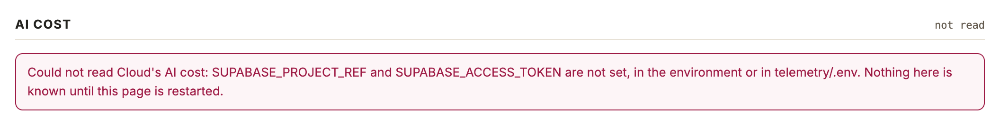

# 没有 Cloud 凭据时打开数据页

## Setup

- **凭据**：`telemetry/.env` 或环境变量里有 Cloudflare 凭据（或已 `npx wrangler login`）；`SUPABASE_PROJECT_REF` 和 `SUPABASE_ACCESS_TOKEN` 都没有设置。

## Steps

1. 在 `telemetry/` 下运行 `npm run numbers:web`。
   终端先说明读不到 Cloud 的 AI 成本以及缺哪两个变量，然后照常打印页面地址；服务没有退出。
   [01-start.log](01-start.log)

2. 打开页面，滚到最后一段「AI cost」。
   这一段右上角写「not read」，正文是一条红色提示，写明缺 `SUPABASE_PROJECT_REF` 和 `SUPABASE_ACCESS_TOKEN`；没有表格，也没有任何 0。
   

3. 看页面的其他几段。
   Overview、Runs and cards、Site、Spread 照常显示，整页只有 AI cost 这一条提示。
   [03-sections.log](03-sections.log)（只记段落标题和提示，没有截其余几段：那是线上的真实使用数据）

## Feedback

- **不挡路**：没配 Cloud 凭据的人照样能看原来的四段，终端和页面两处都说了原因，变量名可以直接照抄。
- **提示的下一步不完整**：页面写「Nothing here is known until this page is restarted」，但只重启不会好，得先把两个变量配上；没提 `.env.example` 里有模板，也没提这两个值就是 `cloud/.env` 里那两个。
- **「可选」没写在页面上**：`.env.example` 说这一段是可选的，页面却用和「线上数据读取失败」同样的红色警示，第一次看会以为出了故障。
- **其他失败没有跑到**：凭据错误（Supabase 回 401）、超时、迁移未应用这几种情况本次没有验证，只跑了缺凭据这一种。
