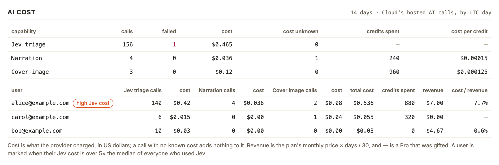
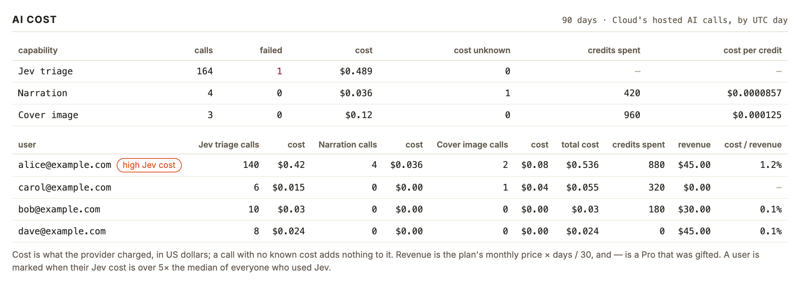

# 在数据页上按能力、按用户查看托管 AI 的成本

## Setup

- **凭据**：`telemetry/.env` 或环境变量里有 Cloudflare 凭据（或已 `npx wrangler login`），以及 Cloud 项目的 `SUPABASE_PROJECT_REF` 和 `SUPABASE_ACCESS_TOKEN`。
- **数据**：Cloud 已应用 `0037_ai_calls.sql`，`cloud.ai_calls` 里有调用记录。
- **本次证据的来源**：这台机器没有 Cloud 项目的凭据，证据是对着一次性 PostgreSQL 里的样例数据跑出来的，没有对真实 Cloud 数据库验证过。重现方法：
  1. 按 `cloud/scripts/check-sql.mjs` 的做法起一个一次性集群，应用 `cloud/test/sql/supabase.sql` 和 `cloud/migrations/*.sql`，再应用本目录的 [seed.sql](seed.sql)（四个虚构账号，日期从今天往回推）。
  2. 在 `telemetry/` 下用本目录的 [stand-in.mjs](stand-in.mjs) 顶替 Supabase 的查询接口启动：
     `PGHOST=<集群目录> PGPORT=<端口> SUPABASE_PROJECT_REF=sample SUPABASE_ACCESS_TOKEN=sample node --import <本目录>/stand-in.mjs scripts/numbers-web.mjs --port 8791`
  页面自己的查询、汇总和渲染都是真的，只有数据库是替身。

## Steps

1. 在 `telemetry/` 下运行 `npm run numbers:web`。
   终端只打印页面地址，没有「Could not read Cloud's AI cost」。
   [01-start.log](01-start.log)

2. 打开页面，滚到最后一段「AI cost」（默认 14 天）。
   - 上表每种能力一行：调用次数、失败次数（非 0 标红）、成本、成本未知的次数、花掉的积分、每积分成本；Jev 不扣积分，后两列是 `—`。
   - 下表每个用户一行，以邮箱标识，按总成本从高到低：各能力的次数与成本、总成本、积分、应计收入、成本占收入的比例。
   - 月付用户 14 天收入 $7.00，年付 $4.67；只靠赠送获得 Pro 的收入 $0.00、比例 `—`。
   - Jev 成本超过中位数 5 倍的用户，邮箱后有「high Jev cost」标记。
   

3. 点页面顶部的「90d」。
   这一段跟着换到 90 天：范围外的用户（dave）出现；收入按 90 天重算（月付 $45.00、年付 $30.00）；只有积分、没有调用记录的旁白（bob）显示为 Narration calls 0、credits spent 180。
   

## Feedback

- **一眼能读出谁贵**：按总成本排序加「high Jev cost」标记，最该看的那一行就在最上面；底下一行说明把成本、收入和标记的口径都交代了，不用翻文档。
- **用户表的三个「cost」同名**：表头是「Jev triage calls / cost / Narration calls / cost / Cover image calls / cost」，要靠位置才知道哪个 cost 属于谁，扫一眼容易看串。
- **0 和「没有」分不开**：没用过某能力的用户显示 `0` 和 `$0.00`，和「用了但成本为 0」长得一样；赠送 Pro 的收入写 `$0.00` 而比例写 `—`，两种写法并排。
- **标记在人少时很敏感**：样例里三个人用 Jev，中位数 $0.03，$0.42 就被标出；真实用户少的时候大概天天有人被标。
- **「cost unknown」容易被忽略**：旁白有一次成本没查到，成本列照常显示一个数，不看旁边那列就不知道它偏低。
- **只在启动时读一次**：想看新数据要重启，页面上只有「read 时间」提示这一点。
- **未在真实数据库上验证**：以上都来自样例数据；第一次带真实凭据打开时，值得对着 Supabase 里的原始行核一遍数字。
