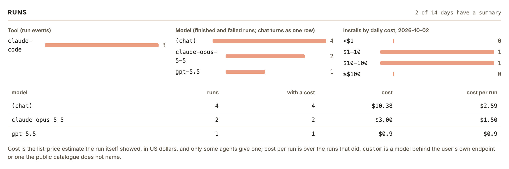

# 在用量数据上查看聊天回合的次数和花费

## Setup

- **凭据**：同 `npm run numbers` / `npm run numbers:web`，能读线上 D1。
- **数据**：线上 Worker 和用户的应用都已更新到 #1495 之后的版本，聊天回合结束时带上模型和本轮花费。
- **本次证据的来源**：线上还没有这类事件，证据来自样例数据。重现方法（在 `telemetry/` 下）：
  1. `node <本目录>/seed.mjs /tmp/qa.sqlite`：用真实迁移建库，按 Worker 的写入和每日汇总 SQL 存下两个虚构安装、两天的运行和聊天事件（其中一条聊天来自旧版本，不带模型和花费）。
  2. `QA_DB=/tmp/qa.sqlite PATH=<本目录>/bin:$PATH npm run numbers`（或 `node scripts/numbers-web.mjs --port 8795`）：`bin/npx` 顶替 `npx wrangler`，把查询转给这个 SQLite。
  命令自己的查询、汇总和渲染都是真的，只有数据库是替身。

## Steps

1. 运行 `npm run numbers`，看「Runs」一段。
   模型表里多一行 `(chat)`：4 次、都带花费、共 $10.38；不带花费的旧版聊天不计入。「Installs by daily cost」把聊天花费算进安装当天的花费（一个安装 $0.9 + $9.5 落入 $10–100）。
   [01-numbers.log](01-numbers.log)

2. 运行 `npm run numbers:web`，打开页面，看「Runs」一段（默认 14 天）。
   模型一栏的标题是「Model (finished and failed runs; chat turns as one row)」，`(chat)` 和各模型并列排序；下方表格与第 1 步一致。
   

## Feedback

- **聊天花费终于看得到**：按花费排序后 `(chat)` 直接排第一，规划和讨论的开销不再藏起来。
- **看不出聊天用的是哪个模型**：所有聊天合成一行，Opus 和 GPT 的聊天花费混在一起，换模型省没省钱无从比较。
- **表头仍叫「runs」「cost per run」**：`(chat)` 那一行其实是回合数和每回合花费，要靠栏目标题里的括号才知道。
- **「Tool (run events)」不含聊天**：上面一栏 3 次，旁边一栏 7 次，第一次看会以为数据对不上。
- **金额格式不一**：同一列里有 `$3.00` 也有 `$0.9`，一美元以下少了末尾的 0。
- **未在真实数据上验证**：线上部署、应用更新后，值得对照一次真实的 `(chat)` 行。
